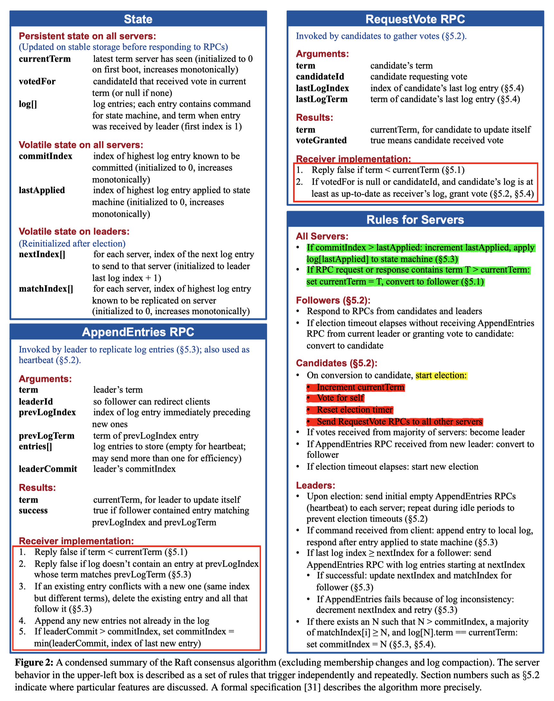
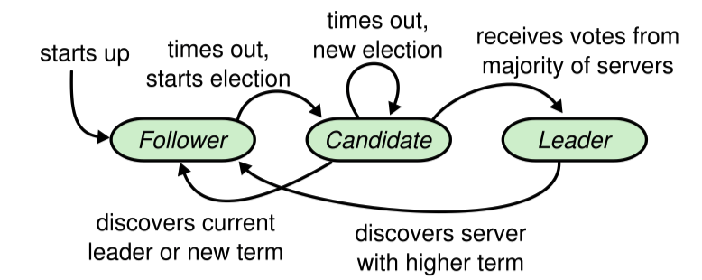
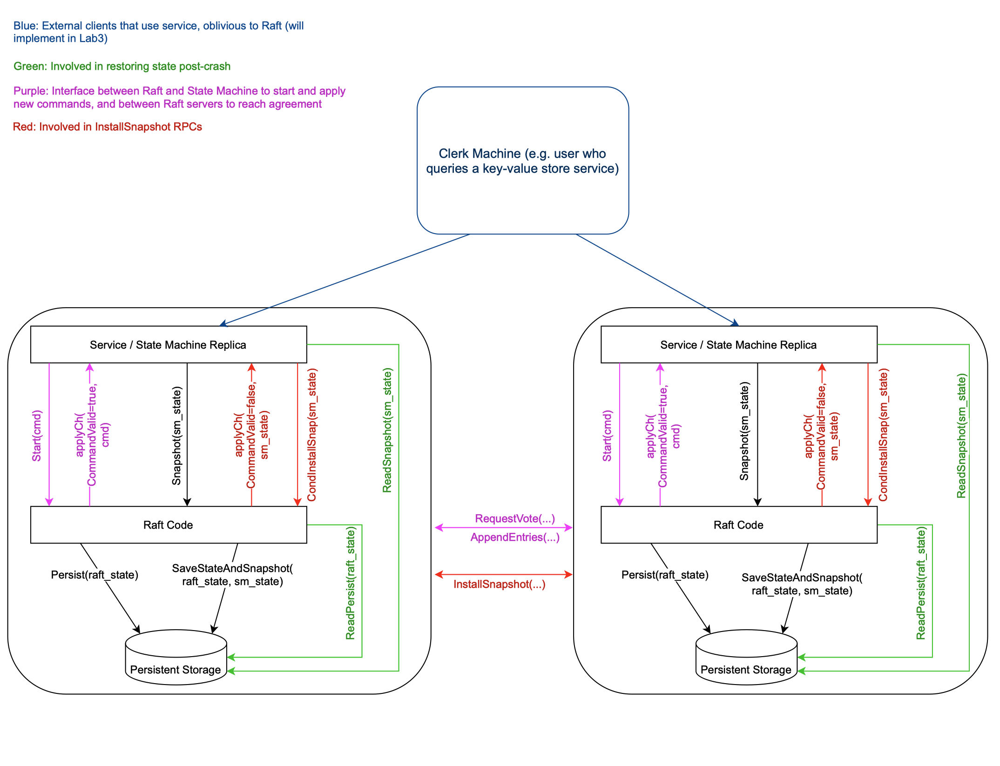

## Lab2A 选举和心跳



### 概括

**lab2A 中每个角色需要做的事情有**

- Allserver
  - RPC request 或者 response 中发现 `term > rf.currentTerm`，则更新 `currentTerm = term` 并且转换状态为 follower
- Follower
  - 处理候选者发来的 RequestVote RPC，以及 leader 发来的 AppendEntry RPC
  - 一旦长时间没有收到 leader 的 AppendEntry 或者给其它 server 投了票，自己就变为候选者（Candidate）
- Candidate
  - 执行选举操作流程
  - 从大多数 server 中获得选票，成为 leader
  - 收到了新的 leader 的 AppendEntry RPC，变回 follower
  - 选举超时，重新发起选举流程
- Leader
  - 定期发送 AppendEntry RPC，重置 election timeout 防止 follower 超时

**难点在于处理 RPC 请求的结果、执行 RPC 请求的时候，对于 server 状态的判断**

- 处理 RPC 结果
  - 对于 election 需要保证收到回复的时候 candidate 还是 candidate，并且任期没有变；
  - 对于 heartbeat，需要保证收到回复的时候 leader 还是 leader 并且任期没有变
- 执行 RPC 请求
  - 对于 AppendEntry，如果 `term < currentTerm`，最返回 false 和 currentTerm；否则按照上面 <u>AllServer</u> 的要求来，并更新选举定时器
  - 对于 RequestVote，如果 `term < currentTerm` 或者 term 相等但是已经投过票了，就返回 false；如果 term > currentTerm，则按照上述 <u>Allserver</u> 的要求来，然后还要更新选举定时器



**[Guide]() 中提到的注意点（和 lab2A 有关的部分）：**

- 确保有且仅有以下场景更新 election timeout
  - 从当前 leader 收到一个 AppendEntries RPC（如果 args 中的 term 过期了，不应该更新）
  - 开始一场新的选举
  - 投票给一个 server
- 候选者正在进行选举的时候，如果选举超时定时器触发了，应该开始一场新的选举，这时候要求对于旧的选举的 RPC 响应信息不予理会
- Figure 2 中这条规则很重要：If RPC request or response contains term `T > currentTerm`: set `currentTerm = T`, convert to follower (§5.1)
  - 例如就算 server 已经在当前的任期中投票，但是传入了一个比当前任期更高的候选者任期，此时应该重新设置 votedFor 并且为该候选者投票

### 结构体定义

`Raft` 结构体中按照 Figure2 增加了以下字段，这些字段在 lab2A 中是必须的

```go
type Raft struct {
	mu        sync.Mutex          // Lock to protect shared access to this peer's state
	peers     []*labrpc.ClientEnd // RPC end points of all peers
	persister *Persister          // Object to hold this peer's persisted state
	me        int                 // this peer's index into peers[]
	dead      int32               // set by Kill()

	// Your data here (2A, 2B, 2C).
	// Look at the paper's Figure 2 for a description of what
	// state a Raft server must maintain.

	// Persistent state on all servers
	currentTerm      int         // 当前任期，开启新一轮选举的时候需要加一
	votedFor         int         // 如果当前节点投票给别人了，则为对方的 id，否则是 -1
	serverState      int         // 三个状态：follower、candidate、leader
	electionTimeout  *time.Timer // 选举超时时间
	heartbeatTimeout *time.Timer // 心跳超时时间
}
```

`RequestVoteArgs` 和 `RequestVoteReply` 定义如下

```go
// 请求选举
// 1. if candidate_term < server_currentTerm, 返回 false
// 2. 对于 lab2A 来说，只需要实现
//    if candidate_term > server_currentTern 并且 server 没有投过票，则给该候选者投票
type RequestVoteArgs struct {
	// Your data here (2A, 2B).
	Term        int // 候选者的任期
	CandidateID int // 请求投票的候选者 id
}
type RequestVoteReply struct {
	// Your data here (2A).
	Term        int  // server 告诉候选者自己当前的任期
	VoteGranted bool // 告诉候选者是否投票给该候选者
}
```

`Make` function 中的初始化如下，重置了 electionTimeout 选举超时时间，以及心跳超时时间，这两个定时器

```go
// Your initialization code here (2A, 2B, 2C).
rf.currentTerm = 0
rf.votedFor = -1
rf.serverState = FOLLOWER                                // follower
rf.electionTimeout = time.NewTimer(electionRandomTime()) // 设置随机选举定时器
rf.heartbeatTimeout = time.NewTimer(appendEntryTime())   // 设置 leader 的心跳定时器
```

### ticker

在 `Make` function 结束的时候，每一个 Raft server 都会在后台执行一个 goroutine 运行 `ticker` 函数。`ticker` 函数的逻辑就是等待超时事件的到来，然后根据超时事件做事件分发

```go
// The ticker go routine starts a new election if this peer hasn't received
// heartsbeats recently.
func (rf *Raft) ticker() {
	for !rf.killed() {
		// Your code here to check if a leader election should
		// be started and to randomize sleeping time using
		// time.Sleep().
		select {
		case <-rf.electionTimeout.C:
			rf.startElection()
		case <-rf.heartbeatTimeout.C:
			rf.broadcastHeartbeat()
		}
	}
}
```

### Election

每当选举超时时间到来的时候就会触发选举机制，<u>`rf.electionTimeout` 在以下时机更新</u>

- 对于 leader 来说，每当发送一次心跳信息就更新
- 对于 follower 来说
  - 每当收到一次 leader 的 AppendEntry 就更新，如果 args.Term 过期了则不应该更新
  - 每当进行一次投票，注意必须是投出了这票，这时也会更新
- 对于 candidate 来说，当变为 candidate 时就更新

<u>具体的选举过程如下</u>，根据 Figure2 的步骤：

1. 更改自身状态，变为 candidate
2. 增加当前任期
3. 为自己投一票
4. 更新选举超时定时器
5. 发送 `RequestVote` RPC 给所有其它的 server，请求它们为自己投票

步骤 5 中需要异步处理 RPC 的发送与结果获取，如果同步处理可能会出现由于网络延迟导致某一个 server 一直在等待某一个 RPC 的结果返回；当有超过半数的 server 为自己投票，该节点就会成为 leader

> 官方的 Guide 中有建议每一个 RPC 都使用一个 goroutine 执行。发起投票时要异步并行去发起投票，从而不阻塞 ticker 协程，这样 candidate 再次 election timeout 之后才能自增 term 继续发起新一轮选举

候选⼈会继续保持着当前状态直到以下三件事情之⼀发⽣：(a) 他⾃⼰赢得了这次的选举，(b) 其他的服务器成为领导⼈，(c) ⼀段时间之后没有任何⼀个获胜的⼈。在等待投票的时候，候选⼈可能会从其他的服务器接收到声明它是领导⼈的附加条⽬（AppendEntries）RPC。如果这个领导⼈的任期号（包含在此次的 RPC中）不⼩于候选⼈当前的任期号，那么候选⼈会承认领导⼈合法并回到跟随者状态。如果此次 RPC 中的任期号⽐⾃⼰⼩，那么候选⼈就会拒绝这次的 RPC 并且继续保持候选⼈状态

#### 发送端（Candidate）

```go
/// 触发选举机制
func (rf *Raft) startElection() {
	rf.mu.Lock()
	defer rf.mu.Unlock()
	// 1. 更改自身的状态为候选者，并增加该节点的当前任期
	rf.setState(CANDIDATE)
	// 2. 增加当前任期
	rf.currentTerm += 1
	// 3. 重置选举超时定时器
	// println("index: " + strconv.Itoa(rf.me) + " startElection, term: " + strconv.Itoa(rf.currentTerm))
	rf.electionTimeout.Reset(electionRandomTime())
	// 4. 发送 RequestVote RPC 请求给其余 servers
	grantedVote := 1
	rf.votedFor = rf.me
	args := rf.getElectionArgs()
	for id := range rf.peers {
		if id == rf.me {
			continue
		}
		// 异步发送请求给其他的 server 节点，避免阻塞 rf.ticker，这样 candidate 在超时之后可以再次发起选举
		go func(peer int) {
			reply := &RequestVoteReply{}
			if rf.sendRequestVote(peer, args, reply) {
				rf.mu.Lock() // 并不会出现死锁，因为这里在另一个执行流了
				defer rf.mu.Unlock()
				// 1) 当前节点可能早就已经变为 leader 了，此时再收到选举投票结果已经不重要了
				// 2) 当前节点也可能收到了 leader 的 heartbeat，那么就已经退化为 follower 了，此时收到选举投票结果也已经不重要了
				// 3) 可能由于一些原因节点的任期会增加，例如收到了 leader 的心跳、或者本轮没有任何人成为 leader，此时过期的消息就不再处理
				if rf.serverState == CANDIDATE && rf.currentTerm == args.Term {
					if reply.VoteGranted {
						grantedVote++
						// println("index: " + strconv.Itoa(rf.me) + ", votes: " + strconv.Itoa(grantedVote))
						if grantedVote > len(rf.peers)/2 {
							println(strconv.Itoa(rf.me) + " become LEADER")
							rf.setState(LEADER)
							// 启动一个新的协程执行，直接在当前协程执行会出现死锁
							go func() {
								rf.broadcastHeartbeat()
							}()
						}
					} else if reply.Term > rf.currentTerm {
						// 对方的任期要大于自身，则更新自身的任期
						rf.currentTerm = reply.Term
						// 将状态改为 follower
						rf.setState(FOLLOWER)
						// 重置该任期内的 revotedFor
						rf.votedFor = -1
					}
				}
			}
		}(id)
	}
}
```

当一个 RPC 请求返回的时候需要考虑：

- 当前节点是不是已经提前收到了某一个成为 leader 的节点发来的心跳信息，这个时候它的 `state` 已经变成了 `FOLLOWER`
- 当前节点收到了来自其它 server 的信息，可能是选举信息、也可能是心跳信息
- 本轮没有任何人成为 leader，已经开始了新的一轮选举

上述三种状况会改变 `rf.serverState` 和 `rf.currentTerm`，对于过期的 RPC 回复应该不予处理

#### 接收端

- server 当前任期大于参数中的任期或者 server 在当前任期已经给别人投过票了，此时应该拒绝这次投票

```go
func (rf *Raft) RequestVote(args *RequestVoteArgs, reply *RequestVoteReply) {
	// Your code here (2A, 2B).
	rf.mu.Lock()
	defer rf.mu.Unlock()

	if rf.currentTerm > args.Term ||  (rf.currentTerm == args.Term && rf.votedFor != args.CandidateID) {
		// 1. 当前任期大于参数重的任期，2. 在当前任期内已经给人投过票了。此时应该拒绝这次的投票
		// println("index: " + strconv.Itoa(rf.me) + " recieved RequestVote but no vote")
		reply.Term = rf.currentTerm
		reply.VoteGranted = false
	} else if args.Term > rf.currentTerm {	// 新一轮任期的投票到来
		// 1. 更新任期
		rf.currentTerm = args.Term
		// 2. 更新投票，这里为了好理解分开来写了
		rf.votedFor = -1
		rf.votedFor = args.CandidateID
		// 3. 更新状态
		rf.setState(FOLLOWER)
		
		reply.VoteGranted = true
		// 只有在投票之后才更新时间
		rf.electionTimeout.Reset(electionRandomTime())
		// println("index: " + strconv.Itoa(rf.me) + " recieved RequestVote and vote it")
	}
}
```

### Heartbeat（心跳）

lab2A 需要新增一个 heartBeat 的 RPC，以实现 `AppendEntry` 的功能，根据 Figure2 RPC 请求和回复的数据结构如下

```go
type AppendEntryArgs struct {
	Term     int // leader 的任期
	LeaderId int // leader 的 id
}

type AppendEntryReply struct {
	Term    int  // server 自己的任期，用来告诉 leader 更新自己的任期
	Success bool //
}
```

#### 发送端（Leader）

leader 需要固定的时间发送心跳信息给所有的 server，每次发送完都需要更新 leader 的选举超时定时器和心跳定时器

这里的实现方式还是和 election 差不多。同样的一个 LEADER 有可能会由于网络延迟变为 follower，并且变为 follower 之后可能会为 term 更高的 server 投票，所以也需要对于过期的消息不予处理

```go
func (rf *Raft) broadcastHeartbeat() {
	rf.mu.Lock()
	defer rf.mu.Unlock()
	if rf.serverState != LEADER {
		return
	}
	// println("index: " + strconv.Itoa(rf.me) + " send heartbeat, state: " + strconv.Itoa(rf.serverState) + ", term: " + strconv.Itoa(rf.currentTerm))
	// 获取参数
	args := rf.getAppendEntryArgs()
	for idx := range rf.peers {
		if idx == rf.me {
			continue
		}
		go func(peer int) {
			reply := &AppendEntryReply{}
			if rf.sendAppendEntry(peer, args, reply) {
				// println("heartbeat reply")
				rf.mu.Lock()
				defer rf.mu.Unlock()
				// 只有节点还是 leader 的时候才会继续处理回复信息，对于过期的信息不予理会
				// 1. 第一个判断的原因是 leader 有可能会变成 follower
				// 2. 第二个判断的原因是，可能会由于网络原因收到过期的消息
				if rf.serverState == LEADER && rf.currentTerm == args.Term {
					if reply.Success {
						return
					}
					// 任何时候只要发现对方的任期大于自己的任期就更新
					if reply.Term > rf.currentTerm {
						// println("index: " + strconv.Itoa(rf.me) + " become FOLLOWER")
						rf.currentTerm = reply.Term
						rf.setState(FOLLOWER)
					}
				}
			}
		}(idx)
	}
	rf.heartbeatTimeout.Reset(appendEntryTime())
	rf.electionTimeout.Reset(electionRandomTime())
}
```

#### 接收端

```go
/// 1. 在等待投票的时候，候选人可能会从其他的服务器接收到声明它是领导人的附加条目（AppendEntries）RPC
/// 	 如果这个领导人的任期号（包含在此次的 RPC中）不小于候选人当前的任期号，那么候选人会承认领导人合法并回到跟随者状态
/// 	 如果此次 RPC 中的任期号比自己小，那么候选人就会拒绝这次的 RPC 并且继续保持候选人状态
func (rf *Raft) AppendEntry(args *AppendEntryArgs, reply *AppendEntryReply) {
	rf.mu.Lock()
	defer rf.mu.Unlock()
	// 1. reply false if term < currentTerm
	if args.Term < rf.currentTerm {
		reply.Success = false
		reply.Term = rf.currentTerm
		return
	}
	if args.Term > rf.currentTerm {
		rf.serverState = FOLLOWER
		reply.Term = rf.currentTerm
		rf.votedFor = -1
	}
	reply.Success = true
	rf.currentTerm = args.Term
	// 收到了 leader 的心跳信息，重置选举超时时间
	rf.electionTimeout.Reset(electionRandomTime())
}
```

### 测试结果

```shell
 li@15:20:12 ~/Desktop/6.824/src/raft   master ± go test -run 2A -race
Test (2A): initial election ...
0 become LEADER
  ... Passed --   3.1  3   54    6382    0
Test (2A): election after network failure ...
0 become LEADER
2 become LEADER
1 become LEADER
  ... Passed --   4.5  3  122    9494    0
Test (2A): multiple elections ...
0 become LEADER
5 become LEADER
5 become LEADER
3 become LEADER
1 become LEADER
4 become LEADER
  ... Passed --   5.5  7  426   37732    0
PASS
ok      6.824/raft      14.261s
```

### 遇到的问题

Lab2A 一开始在 *Test (2A): election after network failure* 测试的时候失败了，原因是在 `RequestVote` 写的有问题，贴下问题代码。这里的问题在于，当新一轮选举到来的时候第一个 if 中的 rf.votedFor 还停留在上一个任期中、并没有被更新。

后面按照 Figure2 的要求更改为不管在什么地方一旦有新任期到来就更新 rf.votedFor = -1

```c++
/// 错误代码
func (rf *Raft) RequestVote(args *RequestVoteArgs, reply *RequestVoteReply) {
	// Your code here (2A, 2B).
	rf.mu.Lock()
	defer rf.mu.Unlock()

	// 1. rf.currentTerm <= args.Term
	// 2. rf.votedFor == -1
	if rf.currentTerm > args.Term || rf.votedFor != -1 {
		println("index: " + strconv.Itoa(rf.me) + " recieved RequestVote but no vote")
		reply.Term = rf.currentTerm
		reply.VoteGranted = false
	} else {
		println("index: " + strconv.Itoa(rf.me) + " recieved RequestVote and vote it")
		reply.VoteGranted = true
		rf.votedFor = args.CandidateID
		rf.currentTerm = args.Term
		rf.serverState = FOLLOWER
		// 只有在投票之后才更新时间
		rf.electionTimeout.Reset(electionRandomTime())
	}
}
```

MIT Guide 中提到的几个注意的点：

- Incorrect RPC handlers

## Lab2B 日志复制

根据 Hint，首先需要做的是实现 Start() 和 AppendEntry 发送新日志的功能

### 数据结构

日志条目 `Entry`

```go
type Entry struct {
	Index   int         // 日志索引
	Term    int         // 日志的任期号
	Command interface{} // 状态机执行的指令
}
```

`Raft` 结构体新增以下内容

```go
// for 2B. all servers
log         []Entry // server 的日志条目（第一个日志的索引号是 1）
commitIndex int     // 节点中被提交日志的最高索引号（初始化为 0）
lastApplied int     // 被应用到状态及的最高日志索引号（初始化为 0）
// for 2B. leaders
/// nextIndex 的含义是 leader 猜测 follower 下一个日志的准备写入位置，所以在传输 PrevLogIndex 的时候需要使用 nextIndex - 1
/// matchInde 是实际 follower 已经和 leader 匹配的日志索引
nextIndex  []int // 记录下一个发送给每个 server 的日志索引号（初始化为 leader 的最后一个日志索引 index + 1）
matchIndex []int // 记录每个 server 已知的复制到该 server 的最高日志索引
```

`RequestVoteArgs` 结构体新增以下内容

```go
// for 2B. 先比较任期，任期大的日志更新；如果任期相同再比较索引，索引号大的就更新
LastLogIndex int // 候选者的最后日志条目索引
LastLogTerm  int // 候选者的最后日志条目的任期
```

`AppendEntryArgs` 结构体新增以下内容

```go
// for 2B
PrevLogIndex int     // 与新日志条目相邻的那个日志条目的索引
PrevLogTerm  int     // PrevLogIndex 的任期
Entries      []Entry // 需要被保存的日志条目（当被用作 heartbeat 时为空，为了提高效率可能一次性发送多个）
LeaderCommit int     // leader 已提交的日志条目的最高索引
```

`AppendEntryReply` 结构体新增以下内容

```go
Add     bool // 用来判断 follower 有没有追加 args.Entries
// 日志冲突优化，相比论文中提到的这里往后延伸了一个索引值
ConflictIndex int // 如果 follower 没有 prevLogIndex 这个日志，conflictIndex = len(log)
ConflictTerm  int // 如果 follower 拥有 prevLogIndex 这个日志，但是 Term 冲突，conflictTerm = log[prevLogIndex].Term
```

### Start

`Start()` 函数根据客户端传入的 `command` 创建一条日志记录，创建日志条目的时候存入实际索引（这里的索引值从 1 开始）、当前任期、客户端命令。需要注意的是，在新增了一条日志之后需要立即设置 Leader 自己的 `matchIndex`，不然会影响到后面的 *commidIndex 更新*

```go
func (rf *Raft) Start(command interface{}) (int, int, bool) {
	index := -1
	term := -1
	isLeader := false

	// Your code here (2B).
	rf.mu.Lock()
	defer rf.mu.Unlock()
	if rf.serverState != LEADER {
		return index, term, isLeader
	}
	entry := rf.appendNewLog(command)
	DPrintf("node[%v] add new entry, log len = %v", rf.me, len(rf.log)-1)
	return entry.Index, rf.currentTerm, true
}

func (rf *Raft) appendNewLog(cmd interface{}) Entry {
	entry := Entry{
		Index:   len(rf.log),
		Command: cmd,
		Term:    rf.currentTerm,
	}
	rf.log = append(rf.log, entry)
	rf.matchIndex[rf.me] = entry.Index
	return entry
}
```

### AppendEntry 接受端

`AppendEntry` 的流程几乎是按照 Figure2 上面的要求来的

1. 检查 Leader 任期是否大于自己的任期
2. 检查本地是否含有传入的 `prevLogIndex` 这条日志，如果没有返回 false
3. 检查 `prevLogIndex` 和 Leader 传入的是否有冲突，如果有就返回 false
4. 判断 `prevLogIndex` 是否等于 follower 最后一个日志的索引，如果是的话就追加 Leader 传入的 `entries[]` 以及更新 `commitIndex`

在出现冲突的时候按照论文中的方法进行了优化，具体表现为：当不存在这条日志时，设置 `reply.ConflictIndex` 为最后一个日志的索引号加一，设置 `reply.ConflictTerm` 为 0；当出现冲突时，设置 `reply.ConflictTerm` 为 follower 在 `prevLogIndex` 处日志的 Term，设置 `reply.ConflictIndex` 为第一个 `Term = ConflictTerm` 的日志的索引

另外在更新 `commitIndex` 以及追加 `entries[]` 的时候首先判断了 `prevLogIndex == len(rf.log) - 1` 是为了考虑下面 *错误记录* 中提到的场景

```go
func (rf *Raft) AppendEntry(args *AppendEntryArgs, reply *AppendEntryReply) {
	rf.mu.Lock()
	defer rf.mu.Unlock()
	reply.Success = false
	reply.Term = rf.currentTerm
	reply.Add = false
	// 1. reply false if term < currentTerm
	if args.Term < rf.currentTerm {
		return
	}
	// 2. if term > currentTerm，按照 Figure2 的要求更新信息
	if args.Term > rf.currentTerm {
		rf.currentTerm = args.Term
		rf.votedFor = -1
		rf.serverState = FOLLOWER
	}
	// 3. 如果本地没有这个日志的话，reply false
	if len(rf.log)-1 < args.PrevLogIndex {
		DPrintf("node[%v] -> node[%v] dont have this index, len(rf.log) = %v, prevLogIndex = %v", rf.me, args.LeaderId, len(rf.log), args.PrevLogIndex)
		reply.ConflictIndex = len(rf.log)
		reply.ConflictTerm = 0
		return
	}
	// 4. 如果本地日志和传入的日志出现冲突，删除冲突位置及之后的所有日志，reply false
	if args.PrevLogIndex > 0 && rf.log[args.PrevLogIndex].Term != args.PrevLogTerm {
		DPrintf("node[%v] -> node[%v] conflict with prevLogIndex = %v, rf.log[].Term = %v, args.Term = %v", rf.me, args.LeaderId, args.PrevLogIndex, rf.log[args.PrevLogIndex].Term, args.PrevLogTerm)
		reply.ConflictTerm = rf.log[args.PrevLogIndex].Term
		rf.log = rf.log[:args.PrevLogIndex-1]
		for idx, entry := range rf.log {
			if entry.Term == reply.ConflictTerm {
				// 按照冲突优化的规则，找到 conflictTerm 对应的最小索引号
				reply.ConflictIndex = idx + 1
				return
			}
		}
		// 没有找到的话就设置为 log 的最后一个索引号
		reply.ConflictIndex = len(rf.log)
		return
	}

	// 指令流到到这里说明 prevLogIndex 没有冲突

	if args.PrevLogIndex == len(rf.log)-1 {
		// 5. 复制新的日志
		rf.log = append(rf.log, args.Entries...)
		// 6. 更新 follower 的 commitIndex
		if args.LeaderCommit > rf.commitIndex {
			// commidIndex = min(leaderCommit, index of last new entry)
			rf.commitIndex = args.LeaderCommit
			if args.LeaderCommit > len(rf.log)-1 {
				rf.commitIndex = len(rf.log)
			}
			DPrintf("node[%v] commitIndex = %v", rf.me, rf.commitIndex)
		}
		reply.Add = true
	}

	reply.Success = true
	// 收到了 leader 有效的心跳信息，重置选举超时时间
	rf.electionTimeout.Reset(electionRandomTime())
}
```

### AppendEntry 发送端

日志一致性信息和 heartbeat 属于同一个 RPC。注意 `nextIndex` 的含义是 *下一个准备写入的日志索引*

1. 更新 `nextIndex`, `matchIndex`。当 Success 的时候，首先根据接受端传回来的 `reply.Add` 判断 `args.Entries` 有没有被 follower 应用；`matchIndex` 只需要设置为 `nextIndex - 1` 即可
   - 如果应用了就把 `nextIndex` 往后增加 `entries_len` 个位置；
   - 如果没有被应用
     - 如果 `args.Entries` 是空的，也就是说准备和 follower 匹配的就是最后一条日志，那么不需要 `nextIndex` 不需要变化；
     - 如果没有被应用，并且 `args.Entries` 非空，那么说明 follower 可能刚加入连接并且在 `prevLogIndex` 后面它自己还有自己的日志，所以需要继续往后看看 follower 的日志有没有冲入，因此 `nextIndex` 加一
2. 更新 `commitIndex`
   - 所有的 `matchIndex` 排个序，然后中间的那个位置的 `matchIndex` 值就是大多数人已经同意（即拷贝了这个日志副本）的日志，因此更新 `commitIndex` 为这个值
3. 如果出现冲突，处理冲突，重新设置发送给 follower 的 `nextIndex`
   - 根据 `reply.ConflictTerm` 在 Leader 自己的日志中找到第一条 `Term = reply.ConflictTerm` 的日志索引，如果找到了就设置 `nextIndex` 为该条日志索引值加一
   - 如果没有找到或者 `reply.ConflictTerm` 为空即等于 0，那么设置 `nextIndex` 为 `reply.ConflictIndex`

这里细节上的处理很重要，稍微处理有问题就会有 Bug

```go
go func(peer int) {
  reply := &AppendEntryReply{}
  if rf.sendAppendEntry(peer, args, reply) {
    rf.mu.Lock()
    defer rf.mu.Unlock()
    // 拒绝过期的消息
    if rf.serverState == LEADER && rf.currentTerm == args.Term {
      if reply.Success {
        if !reply.Add {
          // 过滤过期的回复
          if rf.nextIndex[peer]-1 > args.PrevLogIndex {
            return
          }
          // 不是过期的回复，但是 prevLogIndex 不是对方的最后一个节点，并且匹配成功
          // 那么继续尝试匹配下一个节点
          num := 1
          if num > len(args.Entries) {
            num = len(args.Entries)
          }
          rf.nextIndex[peer] += num
          rf.matchIndex[peer] = rf.nextIndex[peer] - 1
          return
        }
        // 1. 更新 matchIndex 和 nextIndex
        rf.nextIndex[peer] += len(args.Entries)
        rf.matchIndex[peer] = rf.nextIndex[peer] - 1
        // 2. 更新 commitIndex，matchIndex 的中位数就是大多数节点已经复制的 log
        tempMatch := make([]int, 0)
        tempMatch = append(tempMatch, rf.matchIndex...)
        sort.Ints(tempMatch)
        newCommit := tempMatch[len(rf.peers)/2]
        // 论文 5.4.2 节提到 Raft 永远不会通过计算副本的方式提交之前任期的日志
        if newCommit > rf.commitIndex && rf.log[newCommit].Term == rf.currentTerm {
          rf.commitIndex = newCommit
          DPrintf("node[%v] commitIndex = %v", rf.me, rf.commitIndex)
        }
        return
      } else {
        if reply.Term > rf.currentTerm {
          // 原因 1：任期小于对方的任期
          rf.currentTerm = reply.Term
          rf.setState(FOLLOWER)
          rf.votedFor = -1
        } else {
          // 原因 2：日志出现冲突，尝试减少该 server 的 nextIndex
          // 冲突优化
          if reply.ConflictTerm != 0 {
            for k := range rf.log {
              if rf.log[k].Term == reply.ConflictTerm {
                // conflictTerm 的第一个索引值准备下次发送
                rf.nextIndex[peer] = k + 1
                return
              }
            }
          }
          rf.nextIndex[peer] = reply.ConflictIndex
          // rf.nextIndex[peer]--
        }
      }
    }
  }
}(idx)
```

### RequestVote 接受端更改

新增在选举的时候判断候选者的日志是不是比自己新，只有比自己新的时候才选择投票。比自己新的判断依据是，先判断双方最后一条日志的 `Term` 如果相同，再比较双方日志的长度，长度较长的更加新

```go
if args.LastLogTerm < rf.log[logLen-1].Term || (args.LastLogTerm == rf.log[logLen-1].Term && logLen > args.LastLogIndex+1) {
  // 3. 候选者的日志没有自己的日志新，那么拒绝给它投票
  reply.Term = rf.currentTerm
  reply.VoteGranted = false
  DPrintf("node[%v] get RequestVote message and refuse", rf.me)
  return
}
```

### RequestVote 发送端更改

主要是当候选者成为 Leader 的时候初始化 `nextIndex` 为最后一条日志索引值加一，以及 `matchIndex` 为 0

```go
if grantedVote > len(rf.peers)/2 {
  DPrintf("node[%v] become Leader, log nums = %v", rf.me, len(rf.log)-1)
  rf.setState(LEADER)
  // 初始化 nextIndex
  for index := range rf.nextIndex {
    rf.nextIndex[index] = len(rf.log)
    rf.matchIndex[index] = 0
  }
  // 启动一个新的协程执行，直接在当前协程执行会出现死锁
  go func() {
    rf.broadcastHeartbeat()
  }()
}
```

### applyCommit

在 Make 创建 Raft Server 的时候在后台执行一个 goroutine，定期检查 CommidIndex 和 AppliedIndex，执行没有 apply 的命令

```go
func (rf *Raft) applyCommit(applyCh chan ApplyMsg) {
	for !rf.killed() {
		time.Sleep(time.Millisecond * 100)
		msgs := make([]ApplyMsg, 0)
		func() {
			rf.mu.Lock()
			defer rf.mu.Unlock()
			for rf.commitIndex > rf.lastApplied {
				rf.lastApplied++
				msgs = append(msgs, ApplyMsg{
					CommandValid: true,
					Command:      rf.log[rf.lastApplied].Command,
					CommandIndex: rf.lastApplied,
				})
				DPrintf("node[%v] apply command %v", rf.me, rf.lastApplied)
			}
		}()
		for _, msg := range msgs {
			applyCh <- msg
		}
	}
}
```

### 测试结果

```shell
 li@14:57:24 ~/Desktop/6.824/src/raft   master ± time go test -run 2B -race
Test (2B): basic agreement ...
  ... Passed --   1.5  3   24    7236    3
Test (2B): RPC byte count ...
  ... Passed --   3.6  3   64  120232   11
Test (2B): agreement despite follower disconnection ...
  ... Passed --   5.6  3  114   31063    7
Test (2B): no agreement if too many followers disconnect ...
  ... Passed --   4.2  5  212   50135    3
Test (2B): concurrent Start()s ...
  ... Passed --   1.4  3   20    6048    6
Test (2B): rejoin of partitioned leader ...
  ... Passed --   4.7  3  148   37207    4
Test (2B): leader backs up quickly over incorrect follower logs ...
  ... Passed --  43.5  5 3220 2966095  106
Test (2B): RPC counts aren't too high ...
  ... Passed --   2.8  3   50   15328   12
PASS
ok      6.824/raft      69.358s
go test -run 2B -race  9.03s user 2.18s system 16% cpu 1:10.06 total
```

### 建议

- 不要在收到 prevLogIndex 的时候就直接截断 follower，然后开始 append log[]；严格按照 Figure 2 中说的来，只有在出现冲突的时候才截断。原因在于可能会收到一个过期的 AppendEntry，截断日志就意味着收回前面的日志条目
- 当 prevLogIndex > max index of log 的时候，应该当作任期冲突处理
- 最后一个测试需要对冲突处理进行优化
- 考虑场景 `leader_log = [1], follower_log = [1, 2], leader_nextIndex = 2` 并且 follower 和 leader 刚连通
- 考虑场景 `leader_log = [1, 2, 3, 4, 5, 6], follower_log = [1, 2, 3], leader_nextIndex = 3`，并且 follower 和 leader 刚连通，以及 `follower[3] != leader[3]`

### 错误记录

- TestBasicAgree2B

  - 没有更新 commitIndex
  - 没有将 committed 的 log 传输到 ApplyMsg 这个 channel

- TestFailAgree2B, agreement despite follower disconnection

  - 在 leader 添加一个新的日志的时候，忘记更新 `matchIndex[rf.me] = entry.Index`。在添加一个新日志的时候需要先更新匹配数组中自己的值，避免影响排序之后获取 `newCommit` 的结果

- TestBackup2B

  - 出现日志冲突的时候需要加速日志回退，可以参考 https://thesquareplanet.com/blog/students-guide-to-raft/#an-aside-on-optimizations

  - 实际实现完之后还是有问题，bug 原因在于，考虑如下场景：

    - node[1] 的 log 包含 [1, 2, 3]，node[0] 的 log 包含 [1, 2, 3, 4, 5, 6] 并且它是领导者
    - 然后 node[0] 发给 node[1] 的日志匹配项 `prevLogIndex = 2`，并且 node[1] 一直处于断开连接的状态
    - 突然 node[1] 恢复了连接，然后它会把 [3, 4, 5, 6] 都 append 到自己的日志后面去，此时 node[1] 的日志是 [1, 2, 3, 3, 4, 5, 6]
    - node[0] 收到 SUCCESS 的信号之后，把 node[1] 的 `nextIndex` 更新为 `3 + 4 = 7`
    - 下一轮心跳，传输给 node[1] 的 `prevIndex = 6`，对应的日志是 [5]。此时如果 5 和 6 的 Term 是一样的，永远也发现不了冲突，导致 node[1] 自 log[2] 之后就无法 commit 日志了

  - 错误代码如下（已经纠正了 TestRejoin2B 的 bug）：

    - ```go
      	// 4. 如果本地日志和传入的日志出现冲突，删除冲突位置及之后的所有日志，reply false
      	if args.PrevLogIndex > 0 && rf.log[args.PrevLogIndex].Term != args.PrevLogTerm {
      		DPrintf("node[%v] -> node[%v] conflict with prevLogIndex = %v, rf.log[].Term = %v, args.Term = %v", rf.me, args.LeaderId, args.PrevLogIndex, rf.log[args.PrevLogIndex].Term, args.PrevLogTerm)
      		reply.ConflictTerm = rf.log[args.PrevLogIndex].Term
      		rf.log = rf.log[:args.PrevLogIndex-1]
      		for idx, entry := range(rf.log) {
      			if entry.Term == reply.ConflictTerm {
      				// 按照冲突优化的规则，找到 conflictTerm 对应的最小索引号
      				reply.ConflictIndex = idx + 1
      				return
      			}
      		}
      		// 没有找到的话就设置为 log 的最后一个索引号
      		reply.ConflictIndex = len(rf.log)
      		return
      	}
      	// 5. 复制新的日志
      	rf.log = append(rf.log, args.Entries...)
      	// 6. 更新 follower 的 commitIndex
      	if args.LeaderCommit > rf.commitIndex && (len(rf.log) - 1 == args.PrevLogIndex) {
      		// commidIndex = min(leaderCommit, index of last new entry)
      		rf.commitIndex = args.LeaderCommit
      		if args.LeaderCommit > len(rf.log)-1 {
      			rf.commitIndex = len(rf.log)
      		}
      		DPrintf("node[%v] commitIndex = %v", rf.me, rf.commitIndex)
      	}
      	reply.Success = true
      ```

- TestRejoin2B

  - 在更改日志冲突优化之后出现这个测试错误，原因是之前写的逻辑有问题，看下面的错误代码

  - ```go
    // 5. 复制新的日志
    rf.log = append(rf.log, args.Entries...)
    // 6. 更新 follower 的 commitIndex
    if args.LeaderCommit > rf.commitIndex {
      // commidIndex = min(leaderCommit, index of last new entry)
      rf.commitIndex = args.LeaderCommit
      if args.LeaderCommit > len(rf.log)-1 {
        rf.commitIndex = len(rf.log)
      }
      DPrintf("node[%v] commitIndex = %v", rf.me, rf.commitIndex)
    }
    ```

  - 考虑下面的场景：

    - 如果 leader node[1] (Term = 2) 之前一直与 leader node[0] (Term = 3) 处于断开连接的状态
    - 并且在 node[0] 看来它和 node[1] 日志的匹配停留在 index = 2
    - 此时如果 node[1] 突然恢复了连接，会更改状态为 Follower 并且 `AppendEntry` 函数直接执行到下面的代码（**注意：此时 len(node[1].log) = 3，prevIndex = 2，leaderCommit = 3**）
    - 然后 node[1] 会提交自己的 log[3]。显然这是不正确的，node[1] 和 leader 还处在匹配 logIndex = 2 的状态，不能直接提交 log[3]

---

TestRejoin2B 解决方法：在更新 follower 的 `commidIndex` 的时候判断 `prevLogIndex` 是不是到达了 follower 日志的最后一个位置，如果是的话才更新 `commitIndex`

---

TestBackup2B 解决方法

1. 首先在 `reply` 中添加一个参数 `Add bool` 表示是否 append 了 `args.Entries`；
2. 然后对于 RPC 接收端判断如果 `prevLogIndex = rf.logLength - 1` 则进行 append 并更新 `Add` 参数，否则 `Add = false`；
3. 最后对于 RPC 发送端，在收到 `SUCCESS = true` 的时候，判断 `Add == true?`，如果是的话 `nextIndex += len(args.Entries)`，否则 `nextIndex += min(1, len(args.Entries))`

```go
// RPC 接受端
if args.PrevLogIndex == len(rf.log)-1 {
  // 5. 复制新的日志
  rf.log = append(rf.log, args.Entries...)
  // 6. 更新 follower 的 commitIndex
  if args.LeaderCommit > rf.commitIndex {
    // commidIndex = min(leaderCommit, index of last new entry)
    rf.commitIndex = args.LeaderCommit
    if args.LeaderCommit > len(rf.log)-1 {
      rf.commitIndex = len(rf.log)
    }
    DPrintf("node[%v] commitIndex = %v", rf.me, rf.commitIndex)
  }
  reply.Add = true
}

// RPC 发送端
if reply.Success {
  if !reply.Add {
    // 过滤过期的回复
    if rf.nextIndex[peer]-1 > args.PrevLogIndex {
      return
    }
    // 不是过期的回复，但是 prevLogIndex 不是对方的最后一个节点，并且匹配成功
    // 那么继续尝试匹配下一个节点
    num := 1
    if num > len(args.Entries) {
      num = len(args.Entries)
    }
    rf.nextIndex[peer] += num
    rf.matchIndex[peer] = rf.nextIndex[peer] - 1
    return
  }
  // 1. 更新 matchIndex 和 nextIndex
  rf.nextIndex[peer] += len(args.Entries)
  rf.matchIndex[peer] = rf.nextIndex[peer] - 1
  // 2. 更新 commitIndex，matchIndex 的中位数就是大多数节点已经复制的 log
  tempMatch := make([]int, 0)
  tempMatch = append(tempMatch, rf.matchIndex...)
  sort.Ints(tempMatch)
  newCommit := tempMatch[len(rf.peers)/2]
  // 论文 5.4.2 节提到 Raft 永远不会通过计算副本的方式提交之前任期的日志
  if newCommit > rf.commitIndex && rf.log[newCommit].Term == rf.currentTerm {
    rf.commitIndex = newCommit
    DPrintf("node[%v] commitIndex = %v", rf.me, rf.commitIndex)
  }
  return
}
```

---

## lab2C

lab2C 的任务比较简单，但是 lab2C 的测试可能会暴露出之前代码的逻辑错误，debug 比较烦

- 完成 persist 和 readPersist 函数之后，在所有更新了 Raft 持久化数据的地方都执行 `persist` 函数

### persist

`persist` 负责持久化编码

```go
func (rf *Raft) persist() {
	w := new(bytes.Buffer)
	e := labgob.NewEncoder(w)
	e.Encode(rf.currentTerm)
	e.Encode(rf.votedFor)
	e.Encode(rf.log)
	data := w.Bytes()
	DPrintf("node[%v] persist data", rf.me)
	rf.persister.SaveRaftState(data)
}
```

### readPersist

`readPersist` 负责解码，读取持久化数据

```go
func (rf *Raft) readPersist(data []byte) {
	if data == nil || len(data) < 1 { // bootstrap without any state?
		return
	}
	r := bytes.NewBuffer(data)
	d := labgob.NewDecoder(r)
	var currentTerm, votedFor int
	var log []Entry
	if d.Decode(&currentTerm) != nil || d.Decode(&votedFor) != nil || d.Decode(&log) != nil {
		DPrintf("node[%v] readPersist error", rf.me)
	} else {
		DPrintf("node[%v] readPersist successful", rf.me)
		rf.currentTerm = currentTerm
		rf.votedFor = votedFor
		rf.log = log
	}
}
```

### AppendEntry 接受端更改

为了节省节点长时间断开连接开始同步日志的时间，将日志复制的代码改为下面这样

1. 在出现冲突的时候不进行日志截断，留到没有冲突开始比对日志条目的时候进行。测试发现 TestFigure8Unreliable2C 不通过的主要原因就在于，这里对日志截断之后需要调用持久化函数，而每次出现冲突都执行一次持久化函数，在日志比较长的时候很费时间
   - TestFigure8Unreliable2C 这测试用例一共运行不超过40s。前10秒在可靠网络各种插入数据。中间20秒，在不可靠网络中各种插入数据。最后10s，开始的时候，恢复网络，插入一个数据，等待这个数据被提交，如果超过这10s就报错。所以对时间很敏感
2. 为了减少冲突处理时间，将原来没有冲突的时候 Leader 每次加一寻找下一个匹配索引，更改为直接在 Follower 完成追加 `args.Entries` 的任务，这样可以进一步较少 RPC 的传送次数
3. 增加选举超时时间的更新时机，在出现日志冲突的时候也进行更新，原因后面 *错误记录* 有解释
4. lab2B 中实现的日志冲突优化机制更改，现在对于一个任期，只会尝试一次该任期内的日志。处理了 lab2B 的实现方式下一直重复同一条日志的错误，完成的冲突优化过程如下
   - 在出现冲突的时候寻找该任期内第一个 `Term = conflictTerm` 的日志条目，这个过程必定会找到一条日志，因为 `prevLogIndex` 对应的 Term 就等于 `conflictTerm`
   - 设置 `reply.conflictIndex` 为找到的那条日志的索引，之后在发送端更新 `nextIndex = conflictIndex`，*这里注意不要加一*
   - 如果一开始就没有这条日志，那么返回 follower 的最后一条日志的索引

```go
// 4. 如果本地日志和传入的日志出现冲突，删除冲突位置及之后的所有日志，reply false
// 为了节省处理时间，将删除日志的操作留到复制新日志，发现冲突的时候进行截断
// 进行日志截断需要执行持久化函数，而当冲突发生次数较多、并且日志较长的时候很费时间，会导致无法通过 TestFigure8Unreliable2C 测试
if args.PrevLogIndex-firstIndex > 0 && rf.log[args.PrevLogIndex-firstIndex].Term != args.PrevLogTerm {
  reply.ConflictTerm = rf.log[args.PrevLogIndex-firstIndex].Term
  for idx, entry := range rf.log {
    if entry.Term == reply.ConflictTerm {
      // 按照冲突优化的规则，找到 conflictTerm 对应的最小索引号
      reply.ConflictIndex = entry.Index
      return
    }
  }
  // 没有找到的话就设置为 log 的最后一个索引号
  reply.ConflictIndex = rf.log[len(rf.log)-1].Index + 1
  return
}

// 指令流到到这里说明 prevLogIndex 没有冲突

// 5. 复制新的日志
for _, entry := range args.Entries {
  idx := entry.Index
  if idx-firstIndex >= len(rf.log) {
    rf.log = append(rf.log, entry)
    reply.Add = true
  } else {
    // 出现冲突，进行截断日志
    if rf.log[idx-firstIndex].Term != entry.Term {
      rf.log = rf.log[:idx-firstIndex]
      rf.log = append(rf.log, entry)
      reply.Add = true
    }
  }
}
// 有新的日志添加，就进行一次持久化
if reply.Add {
  rf.persist()
}
// 6. 更新 follower 的 commitIndex
if args.LeaderCommit > rf.commitIndex {
  // commidIndex = min(leaderCommit, index of last new entry)
  rf.commitIndex = args.LeaderCommit
  if args.LeaderCommit > rf.log[len(rf.log)-1].Index {
    rf.commitIndex = rf.log[len(rf.log)-1].Index
  }
  DPrintf("node[%v] commitIndex = %v", rf.me, rf.commitIndex)
}

reply.Success = true
```

### AppendEntry 发送端更改

1. 在下面错误记录有提到的一个 Bug 修复
2. 结合上面 Appentry 接受端的更改，对于发送端来说，在收到回复的时候不需要像之前那样处理复杂了。现在不管什么情况，对于 `nextIndex` 的更新，都只需要增加 `len(args.Entries)` 即可，因为 follower 在没有冲突的时候，必定会遍历完所有的 `args.Entries`
3. 日志冲突优化更改

```go
if rf.serverState == LEADER && rf.currentTerm == args.Term && args.PrevLogIndex >= rf.nextIndex[peer]-1 {
  if reply.Success {
    // 1. 更新 matchIndex 和 nextIndex
    rf.nextIndex[peer] += len(args.Entries)
    rf.matchIndex[peer] = rf.nextIndex[peer] - 1
    // 2. 更新 commitIndex，matchIndex 的中位数就是大多数节点已经复制的 log
    if !reply.Add {
      // 没有 append 新的日志那么直接跳过更新，节省时间
      return
    }
    tempMatch := make([]int, 0)
    tempMatch = append(tempMatch, rf.matchIndex...)
    sort.Ints(tempMatch)
    newCommit := tempMatch[len(rf.peers)/2]
    // 论文 5.4.2 节提到 Raft 永远不会通过计算副本的方式提交之前任期的日志
    if newCommit > rf.commitIndex && rf.log[newCommit].Term == rf.currentTerm {
      rf.commitIndex = newCommit
      DPrintf("node[%v] commitIndex = %v", rf.me, rf.commitIndex)
    }
  } else {
    if reply.Term > rf.currentTerm {
      // 原因 1：任期小于对方的任期
      rf.currentTerm = reply.Term
      rf.setState(FOLLOWER)
      rf.votedFor = -1
      rf.persist()
    } else {
      // 原因 2：日志出现冲突，尝试减少该 server 的 nextIndex
      // 冲突优化
      rf.nextIndex[peer] = reply.ConflictIndex
    }
  }
}
```

### 测试结果

更改之后 lab2B 的测试结果，`user time` 平均减少了 3s

```shell
li@11:21:33 ~/Desktop/6.824/src/raft   master ± time go test -run 2B -race
Test (2B): basic agreement ...
  ... Passed --   1.0  3   18    5194    3
Test (2B): RPC byte count ...
  ... Passed --   2.5  3   48  114624   11
Test (2B): agreement despite follower disconnection ...
  ... Passed --   5.2  3  114   29241    7
Test (2B): no agreement if too many followers disconnect ...
  ... Passed --   3.9  5  232   47443    3
Test (2B): concurrent Start()s ...
  ... Passed --   0.8  3   14    4014    6
Test (2B): rejoin of partitioned leader ...
  ... Passed --   4.6  3  154   36864    4
Test (2B): leader backs up quickly over incorrect follower logs ...
  ... Passed --  35.4  5 3196 2611630  102
Test (2B): RPC counts aren't too high ...
  ... Passed --   2.4  3   44   13200   12
PASS
ok      6.824/raft      58.180s
go test -run 2B -race  7.89s user 1.85s system 16% cpu 58.698 total
```

lab2C 的测试结果

```shell
 li@11:36:53 ~/Desktop/6.824/src/raft   master ± time go test -run 2C -race
Test (2C): basic persistence ...
  ... Passed --   6.4  3  142   37229    7
Test (2C): more persistence ...
  ... Passed --  16.6  5 1112  219032   16
Test (2C): partitioned leader and one follower crash, leader restarts ...
  ... Passed --   2.1  3   46   11430    4
Test (2C): Figure 8 ...
  ... Passed --  32.7  5  504   56208    2
Test (2C): unreliable agreement ...
  ... Passed --   6.8  5  268   95682  246
Test (2C): Figure 8 (unreliable) ...
  ... Passed --  34.2  5 2080  326136   99
Test (2C): churn ...
  ... Passed --  16.7  5  828  599144   37
Test (2C): unreliable churn ...
  ... Passed --  16.5  5  948  447839  139
PASS
ok      6.824/raft      132.144s
go test -run 2C -race  16.82s user 3.83s system 15% cpu 2:12.45 total
```

### 错误记录

1. 之前写的代码有个 BUG，当一个过期的 AppendEntry 回复并且 `reply.Add = true` 的时候会导致错误的增加 nextIndex，后面纠正为：在收到 AppendEntry 回复的时候判断 `args.PrevLogIndex >= rf.matchIndex[peer]`，只有当这个条件成立的时候才进行后续处理（之前只有在 Success 并且 Add = false 的时候才判断这个条件）
2. 还是 lab2B 的 bug，之前在出现冲突截断的时候多切了一个日志（prevLogIndex 相邻的前一个日志被截断了）
   - 旧代码：`rf.log = rf.log[:args.PrevLogIndex - 1]`，修改之后为：`rf.log = rf.log[:args.PrevLogIndex]`
3. TestFigure8Unreliable2C 这个测试会模拟不可靠网络。前10秒在可靠网络各种插入数据；中间20秒，在不可靠网络中各种插入数据；最后10s，开始的时候，恢复网络，插入一个数据，等待这个数据被提交，如果超过这10s就报错。所以对时间很敏感
4. TestFigure8Unreliable2C 由于对时间敏感，之前的代码选举时间 reset 有问题，会导致一段时间没法选出 Leader。在 `AppendEntry` 只要过滤掉 Term 的判断之后就 reset，而不是之前只在最后 Sucess 的时候才 reset，因为就算出现日志冲突也算一次有效的心跳
   - 完成这个更改之后 TestFigure8Unreliable2C 测试了 10 次，有一次错误。*具体的 debug 有时间再做吧*
5. lab2B 在加速日志冲突优化的时候有问题。一定要严格按照论文中说的来，一开始理解错了，返回了第一条 `term = conflictTerm` 的日志的后一条索引。一开始想的是对于某一个任期，尝试它第一次出现冲突的日志和该任期中的第一条日志
   - 这样导致了如果日志中该任期的日志只有一条，那么就会无限重试该日志

关于测试错误的讨论可以看 

- [lab2-one(%v) failed to reach agreement · Issue #1 · springfieldking/mit-6.824-golabs-2018 (github.com)](https://github.com/springfieldking/mit-6.824-golabs-2018/issues/1)
- [Issues · springfieldking/mit-6.824-golabs-2018 (github.com)](https://github.com/springfieldking/mit-6.824-golabs-2018/issues)

## lab2D

- 实现 `Snapshot`, `InstallSnapshot`, `CondInstallSnapshot` 函数
- 更改之前查询日志的代码。由于添加了快照，并且我这里使用 log 的第一个元素保存 `lastIncludedIndex` 和 `lastIncludedTerm`，所以所有前面和索引相关的代码都需要额外考虑 `log[0].Index` 的值
- 注意 golang 切片会引用底层数组，导致垃圾回收无法释放内存，具体看这里 [参考链接](https://www.cnblogs.com/ithubb/p/14184982.html)



### Snapshot

`Snapshot` 函数由上层的状态机调用，告诉 Raft 创建了一个日志。Raft 需要根据日志中最后一个索引对其日志进行修剪，当判断出这个快照是一个旧的快照时直接忽略

```go
func (rf *Raft) Snapshot(index int, snapshot []byte) {
	// Your code here (2D).
	rf.mu.Lock()
	defer rf.mu.Unlock()
	firstIndex := rf.log[0].Index
	// 1. 如果是一个旧的快照，直接忽略
	if firstIndex >= index {
		DPrintf("node[%v] create snapshot error, for firstIndex = %v is larger than snapshot lastIndex = %v", rf.me, firstIndex+1, index)
		return
	}
	// 2. 裁剪日志，注意释放内存
	rf.log = rf.ShrinkArray(rf.log[index-firstIndex:])
	rf.log[0].Command = nil
	// rf.snapShot = snapshot
	rf.persister.SaveStateAndSnapshot(rf.encodeState(), snapshot)
	DPrintf("node[%v] create snapshot successful, current effective firstIndex = %v", rf.me, index+1)
}
```

### InstallSnapshot

`InstallSnapshot` 是 Leader 用来通知 Follower 使用快照来更新其日志。follower 在收到 Leader 传递过来的消息的时候，将 snapshot 放入 ApplyMsg 通知上层的状态机，之后状态机会调用 `CondInstallSnapshot` 判断能否应用该快照

- `InstallSnapshot` 也相当于一次心跳信息，所以需要判断 Term 以及更新选举超时定时器、
- 使用写成给上层状态机发送消息，避免阻塞等待

```go
type InstallSnapshotArgs struct {
	Term              int    // Leader 的任期
	LeaderId          int    // Leader 的编号
	LastIncludedIndex int    // 被快照替换的日志的最后索引位置
	LastIncludedTerm  int    // LastIncludedIndex 日志的任期
	Data              []byte // snapshot 分块的元数据
	Done              bool   // true 表示这是最后一个快照分块
}

type InstallSnapshotReply struct {
	Term int // 当前任期，告诉 Leader 来更新自己的状态
}

/// 当 follower 收到 Leader 传过来的快找时，它需要将快照传递给状态机，通过 applyCh 传递
/// 状态机在收到快照之后，会调用 CondInstallSnapshot 判断能不能进行安装
func (rf *Raft) InstallSnapshot(args *InstallSnapshotArgs, reply *InstallSnapshotReply) {
	rf.mu.Lock()
	defer rf.mu.Unlock()
	reply.Term = rf.currentTerm
	// 1. 如果 term < currentTerm，立即返回
	if args.Term < rf.currentTerm {
		return
	}
	// 2. 和收到心跳时候一样，判断是不是需要更新 Term
	if args.Term > rf.currentTerm {
		rf.currentTerm = args.Term
		rf.votedFor = -1
		rf.setState(FOLLOWER)
		rf.persist()
	}
	// 3. 发送快照给状态机
	go func() {
		rf.applyCh <- ApplyMsg{
			CommandValid:  false,
			SnapshotValid: true,
			Snapshot:      args.Data,
			SnapshotTerm:  args.LastIncludedTerm,
			SnapshotIndex: args.LastIncludedIndex,
		}
	}()
	// 4. 更新选举超时定时器
	rf.electionTimeout.Reset(electionRandomTime())
}
```

### CondInstallSnapshot

`CondInstallSnapshot` 用来告诉上层服务能否应用该快照，如果可以应用则 Raft 节点需要更新其日志

- 由于在 Raft 调用 `InstallSnapshot` 上层状态机收到快照，和执行 `CondInstallSnapshot` 之间，可能中间会提交新的日志。所以如果该快照没有自己的状态新，那么就返回 false
- 接受该快照的时候需要注意下面代码中 "2." 这里的条件处理
- 最后需要更新 commitIndex 和 lastApplied

```go
func (rf *Raft) CondInstallSnapshot(lastIncludedTerm int, lastIncludedIndex int, snapshot []byte) bool {

	// Your code here (2D).

	rf.mu.Lock()
	defer rf.mu.Unlock()
	// 1. 拒绝旧的快照。只有 commitIndex 才能说明当前节点的状态
	if rf.commitIndex >= lastIncludedIndex {
		return false
	}
	// 2. 更新 Raft 自己的日志
	DPrintf("node[%v] CondInstallSnapshot, lastIncludedIndex = %v, log[0].Index = %v", rf.me, lastIncludedIndex, rf.log[0].Index)
	if lastIncludedIndex-rf.log[0].Index < len(rf.log) {
		rf.log = rf.ShrinkArray(rf.log[lastIncludedIndex-rf.log[0].Index:])
	} else {
		rf.log = make([]Entry, 1)
		rf.log[0].Index = lastIncludedIndex
		rf.log[0].Term = lastIncludedTerm
	}
	rf.log[0].Command = nil

	rf.persister.SaveStateAndSnapshot(rf.encodeState(), snapshot)
	// 3. 更新 commitIndex 和 appliedIndex
	rf.commitIndex = lastIncludedIndex
	rf.lastApplied = lastIncludedIndex

	// rf.snapShot = snapshot
	return true
}
```

### readPersist 更改

新增了在读取完持久化数据之后，更新 `commitIndex` 和 `lastApplied` 为 `log[0].Index`，具体理由见下面的 *“注意内容”*

```go
if d.Decode(&currentTerm) != nil || d.Decode(&votedFor) != nil || d.Decode(&log) != nil {
  DPrintf("node[%v] readPersist error", rf.me)
} else {
  rf.currentTerm = currentTerm
  rf.votedFor = votedFor
  rf.log = log
  rf.commitIndex = rf.log[0].Index
  rf.lastApplied = rf.log[0].Index
  DPrintf("node[%v] readPersist successful, log[0].Index = %v", rf.me, rf.log[0].Index)
}
```

### broadcastHeartbeat 更改

现在需要先判断 `prevLogIndex` 和 Leader 自己的 `log[0].Index` 的大小

- 如果 `prevLogIndex < log[0].Index`，则发送快照
- 否则按照之前的处理即可

```go
prevLogIndex := rf.nextIndex[idx] - 1
if prevLogIndex < rf.log[0].Index {
  // 如果 Leader 当前日志中没有该日志条目，那么就发送快照
  args := rf.getInstallSnapshotArgs()
  DPrintf("node[%v](Term = %v) -> node[%v] snapshot, prevLogIndex = %v", rf.me, rf.currentTerm, idx, prevLogIndex)
  go func(peer int) {
    reply := &InstallSnapshotReply{}
    if rf.sendInstallSnapshot(peer, args, reply) {
      rf.mu.Lock()
      defer rf.mu.Unlock()
      if reply.Term > rf.currentTerm {
        rf.currentTerm = reply.Term
        rf.votedFor = -1
        rf.setState(FOLLOWER)
        rf.persist()
        return
      }
      rf.nextIndex[peer] = rf.log[0].Index + 1
      rf.matchIndex[peer] = rf.nextIndex[peer] - 1
    }
  }(idx)
}
```

### 注意内容

对于日志索引的更改很容易出错，但是 debug 过程中基本都能发现，可以说是一个体力活

1. 当 Leader 传递快照给 Follower 的时候，此时如果 Follower 日志只有两个索引 `[0, 1]`，而 Follower 传递过来的快照的 `lastIncludedIndex = 9`。如果直接对 Follower 的日志按照 `lastIncludedIndex - log[0].Index` 进行截断的话会导致越界访问
2. `RequestVote` 选举的时候，对于候选者和跟随者谁的日志更新这里的判断，忘记对索引进行更改了
3. 不要忘记在 `readPersist()` 读取持久化数据之后，更新 `commitIndex = lastApplied = log[0].Index`
   - 这在之前的实验中没有这么做，因为之前的实验没有快照，所以当读取了持久化数据之后需要把所有的日志内容重新做一遍，相当于 `commidIndex = lastApplied = 0`
   - 而现在由于有了快照，快照中存有最新的状态，因此我们的 `commitIndex` 和 `lastApplied` 只需要从 `log[0].Index` 恢复即可

### 测试结果

lab2D 测试结果：

```shell
li@16:20:29 ~/Desktop/6.824/src/raft   master ± go test -run 2D -race
Test (2D): snapshots basic ...
  ... Passed --  13.2  3  258   89358  251
Test (2D): install snapshots (disconnect) ...
  ... Passed --  75.5  3 1704  473554  386
Test (2D): install snapshots (disconnect+unreliable) ...
  ... Passed --  94.8  3 2364  608161  368
Test (2D): install snapshots (crash) ...
  ... Passed --  44.8  3  914  260370  366
Test (2D): install snapshots (unreliable+crash) ...
  ... Passed --  70.5  3 1448  384408  374
PASS
ok      6.824/raft      299.045s
```

所有的测试结果。官方有提到完整的 lab2 测试的合理时间是 8min real time 和 1.5 min cpu time 左右：

```shell
li@22:44:28 ~/Desktop/6.824/src/raft   master ± time (go test -run 2A -race && go test -run 2B -race && go test -run 2C -race && go test -run 2D -race)
Test (2A): initial election ...
  ... Passed --   3.1  3   58   16608    0
Test (2A): election after network failure ...
  ... Passed --   4.5  3  130   25438    0
Test (2A): multiple elections ...
  ... Passed --   5.4  7  612  115322    0
PASS
ok  	6.824/raft	13.137s
Test (2B): basic agreement ...
  ... Passed --   1.0  3   18    5194    3
Test (2B): RPC byte count ...
  ... Passed --   2.5  3   48  114624   11
Test (2B): agreement despite follower disconnection ...
  ... Passed --   6.3  3  134   36305    8
Test (2B): no agreement if too many followers disconnect ...
  ... Passed --   3.8  5  228   45978    4
Test (2B): concurrent Start()s ...
  ... Passed --   0.6  3   10    2858    6
Test (2B): rejoin of partitioned leader ...
  ... Passed --   6.5  3  188   46933    4
Test (2B): leader backs up quickly over incorrect follower logs ...
  ... Passed --  31.3  5 2720 2170125  103
Test (2B): RPC counts aren't too high ...
  ... Passed --   2.3  3   42   12614   12
PASS
ok  	6.824/raft	54.590s
Test (2C): basic persistence ...
  ... Passed --   4.1  3   96   24319    6
Test (2C): more persistence ...
  ... Passed --  17.1  5 1092  223986   16
Test (2C): partitioned leader and one follower crash, leader restarts ...
  ... Passed --   2.0  3   42   10260    4
Test (2C): Figure 8 ...
  ... Passed --  36.0  5 1532  341982   26
Test (2C): unreliable agreement ...
  ... Passed --   8.3  5  332  111324  246
Test (2C): Figure 8 (unreliable) ...
  ... Passed --  37.8  5 3276 6494005  217
Test (2C): churn ...
  ... Passed --  16.4  5  684  269690  173
Test (2C): unreliable churn ...
  ... Passed --  16.6  5  940  289380  137
PASS
ok  	6.824/raft	138.585s
Test (2D): snapshots basic ...
  ... Passed --   7.5  3  146   55840  251
Test (2D): install snapshots (disconnect) ...
  ... Passed --  85.6  3 1882  533913  407
Test (2D): install snapshots (disconnect+unreliable) ...
  ... Passed --  100.4  3 2398  625165  344
Test (2D): install snapshots (crash) ...
  ... Passed --  40.9  3  848  246351  377
Test (2D): install snapshots (unreliable+crash) ...
  ... Passed --  58.7  3 1200  331473  384
PASS
ok  	6.824/raft	293.342s
( go test -run 2A -race && go test -run 2B -race && go test -run 2C -race && )  50.03s user 10.78s system 12% cpu 8:21.18 total
```

## 