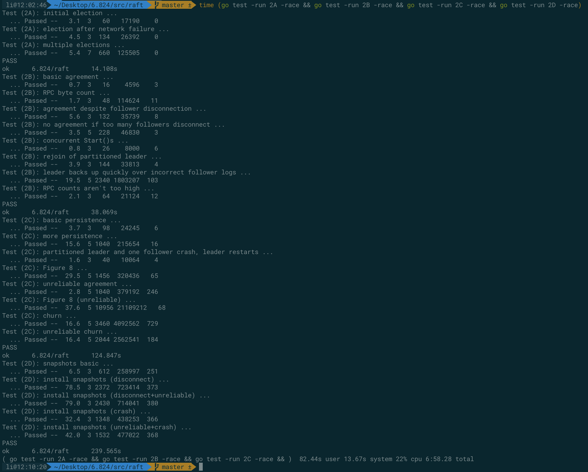

## lab3A


### lab2 更改

针对 lab2 的 Raft 代码，做了以下更改

1. 每一个函数最多只调用一次 `rf.persist()` 持久化函数，减少时间占用
2. `applyCommit()` 的睡眠时间从 `100ms` 更改为 `20ms`
3. `Start()` 之后立马调用心跳函数，不然通过等待心跳来同步还是太慢了
4. 其它一些 lab2 没有做好的地方

做的过程中发现 `TestSpeed3A` 一开始的速度是 `200ms` 左右。原因在于 clerk 需要在 kvserver 执行完一条命令之后才可以继续发送命令，因此这里速度慢的问题就在于 kvserver 不能快速执行一条 clerk 提交的命令

检查发现主要有两个原因导致了速度慢

- 第一个就是 `applyCommit` goroutine 的睡眠时间过长
  - 想象一下 clerk 几乎瞬间在获取了前一条命令的结果之后立马发送下一条命令，而发送了下一条命令并且 Raft commit 之后，applyCommit goroutine 却在睡眠，没有及时让 kvserver 知道可以执行下一条命令了
- 第二个就是 `Start` 提交命令之后在等待心跳同步日志
  - 想象一下心跳刚过去，而 clerk 提交了一条命令，此时需要等待下一次心跳才可以将日志同步给其它 kvserver，然后才能 commit 并 apply

最后，速度从 `200ms/op` 提升到了小于 `33ms/op`，稳定通过 `TestSpeed3A`

### lab2 更改造成的影响

或许是现在 Raft 日志提交的速度加快，新命令从 kvserver 到 Raft 提交的速度也加快，导致创建快照的速度也加快。而这时候由于网络问题就导致了 test 2D 有概率没发通过了。最后发现具体的出错场景如下：

- leader 发送给 follower 心跳，并且 `prevLogIndex = 6226, len(args.Entries[]) = 5`
- follower 同步了 args 携带的日志，并且更新 commitIndex 到 6331，但是由于网络问题返回结果没有及时传达到 leader
- follower 在 apply 6228 这条日志的时候创建了快照，现在 `follow.log[0].Index = 6228`
- leader 再一次发送和第一步相同的心跳信息给 follower
- follower 收到了这条信息，然后在复制和截断日志的时候，由于 lab2 实现的代码是通过 `rf.log[entry.Index-firstIndex].Term != entry.Term` 来实现的。所以这个时候 `entry.Index = 6227, firstIndex = 6228` 导致了 `rf.log` 的索引值是 -1

解决方法是，在判断冲突之前，增加判断 `entry.Index - firstIndex > 0`

```go
// 5. 复制新的日志
for _, entry := range args.Entries {
  idx := entry.Index
  if idx-firstIndex >= len(rf.log) {
    rf.log = append(rf.log, entry)
    reply.Add = true
  } else {
    // 出现冲突，进行截断日志
    // DPrintf("node[%v], idx = %v, firstIndex = %v", rf.me, idx, firstIndex)
    if idx-firstIndex > 0 && rf.log[idx-firstIndex].Term != entry.Term {
      rf.log = rf.log[:idx-firstIndex]
      rf.log = append(rf.log, entry)
      reply.Add = true
    }
  }
}
```

### 数据结构

*RPC 数据结构如下* 没有按照代码框架那样区分 `Get`、`PutAppend`，这里将三者统一成一个 `Command`

```go
type CommandArgs struct {
	Key      string
	Value    string
	Op       string
	ClientId int64
	Seq      int64
	LeaderId int //测试用
}

type CommandReply struct {
	Err   Err
	Value string
}
```

*Clerk 和 KVServer 的数据结构*

- 使用 clientId 和 sequenceNum 用来唯一标识一条命令，避免 kvserver 处理重复的命令，sequenceNum 是一个递增的值
- `maxSequence` 记录每个 clerk 上一次执行的命令的 sequenceNum，用来判断某一个命令是不是过期的
- `kvDB` 即键值数据库，这里用内存来模拟
- `commandDetail` 用来记录 clerk 提交命令时候的详细信息、以及包括一个 clerk 和 kvserver 通信的 channel，在 Raft 提交日志给 kvserver 执行的时候用来判断是否需要唤醒等待中的 clerk

```go
type Clerk struct {
	servers []*labrpc.ClientEnd
	// You will have to modify this struct.
	leaderId    int   // 记录 Leader 的编号
	clientId    int64 // client 编号（随机生成）
	sequenceNum int64 // command 编号（递增）
	// 采用 clientId 和 sequenceNum 唯一标识一个 command，sequenceNum 在 kvserver 执行成功之前不能变
}

type KVServer struct {
	mu      sync.Mutex
	me      int
	rf      *raft.Raft
	applyCh chan raft.ApplyMsg
	dead    int32 // set by Kill()

	maxraftstate int // snapshot if log grows this big

	// Your definitions here.
	maxSequence map[int64]int64 // 记录 client 的最新提交，避免重复执行 Write 操作
	kvDB        map[string]string // KV 存储
	// 1. 对客户端提交命令来说，用来记录命令的信息和等待在 ReplyMsg::Notify 这个 channel 上
	// 2. 对 kvserver 来说执行命令来说，用来对比命令的信息来决定是否往 Notify channel 上写数据来唤醒客户端
	commandDetail map[int64]ReplyMsg
}
```

*ReplyMsg 数据结构*

- `Notify` 是 clerk 和 kvserver 之间沟通的 channel
- `ClientId` 提交命令时候的 clentId，`Seq` 提交的命令编号
- ClinetId + Seq 在 kvserver 执行完命令时候判断这条命令是不是 clerk 之前在 *同一个索引* 上等待的命令，由于可能会被新的 leader 覆盖相同索引处的日志，所以这种判断是很有必要的。如果日志被覆盖了，就不应该唤醒在该索引处等待的 clerk，而是让它超时，以便 clerk 可以寻找真正的 leader

```go
type ReplyMsg struct {
	Notify   chan CommandReply // kvserver 执行完命令之后用来唤醒 clerk
	ClientId int64             // 记录提交命令时候的 clientId
	Seq      int64             // 记录提交命令时候的命令编号
}
```

*Op 数据结构* Op 是 kvserver 用来传递给 Raft 的 "Command"，在 Raft 提交日志的时候会传递回来给 kvserver。根据 Op 中包含的 `Key + Value + Op` 我们可以确定执行什么操作，根据 `ClientId + Seq` 我们可以确定是否需要唤醒等待在该日志索引处的 clerk

```go
type Op struct {
	// Your definitions here.
	// Field names must start with capital letters,
	// otherwise RPC will break.
	Key      string
	Value    string
	Op       string
	ClientId int64
	Seq      int64
	LeaderId int // 测试用
}
```

### Clerk Command 函数

`Command()` 函数用来寻找 Leader kvserver，并调用 `kv.Command` RPC 发送命令操作给 kvserver，如果对方不是 leader 或者超时，则会随机更换节点重新尝试

> ck.servers[] 已经是随机排列过的结果，例如 ck.servers[0] 对应的 servers 并不一定是 0

当 RPC 返回并且命令执行成功的之后需要对 `sequenceNum` 进行加一，以标识不同的命令

在 clerk 收到 `ErrNokey` 错误的时候也应该要更新 `sequenceNum`。原因是，考虑以下场景：

- 初始的时候 `sequenceNum = 0` 然后 clerk 发送的第一条命令是 `GET` 命令，此时肯定会返回一个 `ErrNokey` 的错误，因为当前 kv 存储中根本不存在任何的数据；
- 如果此时没有更新 `sequenceNum` 的话，`sequenceNum` 还是等于 0；
- 然后紧接着 clerk 发送了第二条 `APPEND` 命令，结果会因为在 server 中判断发现当前已经执行过 `sequenceNum = 0` 的命令了就不会执行这条 `Append` 命令了

```go
func (ck *Clerk) Command(key string, value string, op string) string {
	// You will have to modify this function.
	args := &CommandArgs{
		Key:      key,
		Value:    value,
		Op:       op,
		ClientId: ck.clientId,
		Seq:      ck.sequenceNum,
	}
	for {
		reply := &CommandReply{}
		args.LeaderId = ck.leaderId
		ok := ck.servers[ck.leaderId].Call("KVServer.Command", args, reply)
		// 非 ErrNokey 的错误，换个 Leader 重新尝试
		if !ok || reply.Err == ErrWrongLeader || reply.Err == ErrTimeout {
			ck.leaderId = (ck.leaderId + 1) % len(ck.servers)
			time.Sleep(time.Millisecond * 100)
			continue
		}
		ck.sequenceNum++
		// RPC 执行成功，更新 sequenceNum
		// 这里并不会出现 server 连续执行完两条命令，然后第一条命令的执行结果返回，导致两条命令在 server 中的 sequenceNum 是一样的。
		// 因为这里的 command 是一个单线程程序，上一条命令没有返回成功之前，下一条命令无法执行。
		return reply.Value
	}
}

```

### server Command RPC

kvserver 的 `Command()` 函数执行内容如下：

1. 判断 clerk 传递过来的命令是不是一个重复的命令，根据 `maxSequence` 进行判断
   - 这里出现重复命令的一个场景是：clerk 发送编号为 0 的命令给 kvserver，kvserver 执行完命令之后突然断线了；然后 clerk 会尝试发送命令给其它的节点；在其它节点选举超时之前，leader kvserver 又恢复了；clerk 转了一圈又会回到该 kvserver，又发送了同一条命令给 kvserver。所以需要进行重复命令判断
2. 根据 clerk 传递过来的内容创建 `Op` 数据结构，并执行 `rf.Start()` 提交给 Raft
3. 如果该 kvserver 确实是一个 leader，Raft 会返回该命令在 Raft 日志中的索引，根据该索引创建一个 channel 并记录该命令的唯一编号（clientId + Seq）
4. clerk 在 channel 处睡眠，等待被 kvserver 唤醒，同时注册一个超时定时器。此时有两种可能
   - 正常唤醒
   - 定时器唤醒
5. 最后创建一个 goroutine 回收第三步创建的内存，因为一个索引只会被用到一次，所以回收是没有问题的

```go
func (kv *KVServer) Command(args *CommandArgs, reply *CommandReply) {
	kv.mu.Lock()
	// 1. 如果是 Get 之外的重复命令，避免重复执行
	if args.Op != OP_GET && kv.isRepeatCommand(args.ClientId, args.Seq) {
		kv.mu.Unlock()
		return
	}
	kv.mu.Unlock()
	// 2. 其余的 Command 创建一条 Raft 日志。这里不需要对 kvserver 加锁，在 Raft 内部它自己会加锁
	op := Op{
		Key:      args.Key,
		Value:    args.Value,
		Op:       args.Op,
		ClientId: args.ClientId,
		Seq:      args.Seq,
		LeaderId: args.LeaderId,
	}
	index, _, isLeader := kv.rf.Start(op)
	if !isLeader {
		reply.Err = ErrWrongLeader
		return
	}
	// 3. 创建一个 channel，等待 Raft 提交该命令并且 kvserver 执行该命令之后，通过 channel 唤醒客户端
	kv.mu.Lock()
	kv.commandDetail[int64(index)] = ReplyMsg{
		ClientId: op.ClientId,
		Seq:      op.Seq,
		Notify:   make(chan CommandReply),
	}
	notifyCh := kv.commandDetail[int64(index)].Notify
	kv.mu.Unlock()
	// 4. 等待 kvserver 唤醒
	select {
	case result := <-notifyCh:
		reply.Value = result.Value
		reply.Err = result.Err
	case <-time.After(time.Second * 2):
		reply.Err = ErrTimeout
	}
	// 5. 后台回收 channel 的内存空间
	go func() {
		kv.mu.Lock()
		defer kv.mu.Unlock()
		delete(kv.commandDetail, int64(index))
	}()
}

```

### server waitApplyMsg

`waitApplyMsg()` 由一个 goroutine 执行，等待 Raft 提交日志到 `applyCh` 上。其执行过程如下：

1. 判断 Raft 提交的命令是不是一个重复的命令
   - 这里出现重复命令的一个可能场景如下，另一个可能的场景在注释中写出：
     - kvserver0 执行完了 clerk 传递来的命令，并更新了 `maxSequence`，但是在返回 clerk 之前断线了；
     - 然后新的 leader 被选举出来，clerk 尝试发给新的 leader（kvserver1），此时原来断线的节点恢复了；
     - raft1 收到之后，开始同步日志给 followers
     - raft0 发现日志冲突，更新到 raft1 的日志（新旧日志的区别只有 Term 不一样），然后 leader 提交了这条日志，raft0 也跟着提交
     - kvserver0 收到了 raft0 提交的日志，但是这条日志内容是已经执行过的，所以需要判断是否是重复的命令
2. 根据 `op.Op` 执行对应的操作，执行完毕之后更新 `maxSequence`
3. **这里很重要** 如果 `applyMsg.CommandIndex` 处有 clerk 在等待、并且 clerk 在 `applyMsg.CommandIndex` 处等待的日志确实就是当前正在执行的日志，那么就进行日志提交
   - 针对第一个判断，很容易理解，因为如果没有 clerk 在等待的话，Raft 层的 apply commit 协程就会永远睡眠在 `applyMsg <- msg` 上了，导致后面的 commit 都不能被传递到 kvserver 执行
   - 针对第二个判断，考虑下面的场景
     - clerk 提交命令给 kvserver0，返回索引 `idx`，并在 channel 上等待被唤醒
     - 马上 kvserver0 就不是 leader 了，新的 leader 日志的 `idx` 处内容与 kvserver0 冲突，因此同步为新 leader 的日志
     - kvserver0 提交 `idx` 处的日志，但是由于这条日志已经不是 clerk 正在等待的日志，所以不应该唤醒它

```go
// kvserver 执行 Raft 提交的日志
func (kv *KVServer) waitApplyMsg() {
	for !kv.killed() {
		applyMsg := <-kv.applyCh
		op := applyMsg.Command.(Op)
		reply := CommandReply{}
		if applyMsg.CommandValid {
			// 这里判断重复消息的原因：
			// 1. client 发送 command 给 kvserver，kvserver 执行完命令但是还没有更新 maxSequence，也没有返回结果给客户端
			// 2. 此时 client 超时，于是 client 再一次发出该命令
			// 3. 因此第二次发出的命令被提交到 kvserver 的时候需要判断是不是重复的命令
			kv.mu.Lock()
			if op.Op != OP_GET && kv.isRepeatCommand(op.ClientId, op.Seq) {
				DPrintf("client[%v] - server[%v] - command[%v] repeat command", op.ClientId, op.LeaderId, op.Seq)
			} else {
				switch op.Op {
				case OP_PUT:
					kv.kvDB[op.Key] = op.Value
				case OP_APPEND:
					kv.kvDB[op.Key] += op.Value
				case OP_GET:
					if _, ok := kv.kvDB[op.Key]; ok {
						// key 不存在对应的 value，返回错误信息
						reply.Value = kv.kvDB[op.Key]
					} else {
						// 否则返回对应的 value 值
						reply.Err = ErrNoKey
					}
				}
			}
			// 更新 maxSequence
			kv.maxSequence[op.ClientId] = op.Seq
			// 只有 leader 才有权利去唤醒客户端
			// 第二个逻辑判断的原因是，避免旧 leader 的日志被新 leader 的日志覆盖，导致错误唤醒等待在旧 leader 中的客户端
			if value, ok := kv.commandDetail[int64(applyMsg.CommandIndex)]; ok && kv.isSameCommand(&value, &op) {
				kv.commandDetail[int64(applyMsg.CommandIndex)].Notify <- reply
			}
			kv.mu.Unlock()
		}
	}
}

```

### 测试结果

lab2 整体加快了不少

```shell
li@20:17:09 ~/Desktop/6.824/src/raft   master ± time (go test -run 2A -race && go test -run 2B -race && go test -run 2C -race && go test -run 2D -race)
Test (2A): initial election ...
  ... Passed --   3.1  3   60   17310    0
Test (2A): election after network failure ...
  ... Passed --   4.5  3  134   26320    0
Test (2A): multiple elections ...
  ... Passed --   5.4  7  648  122420    0
PASS
ok  	6.824/raft	13.233s
Test (2B): basic agreement ...
  ... Passed --   0.6  3   16    4564    3
Test (2B): RPC byte count ...
  ... Passed --   1.8  3   48  114528   11
Test (2B): agreement despite follower disconnection ...
  ... Passed --   4.0  3   98   25101    7
Test (2B): no agreement if too many followers disconnect ...
  ... Passed --   3.6  5  236   47704    3
Test (2B): concurrent Start()s ...
  ... Passed --   0.8  3   26    8058    6
Test (2B): rejoin of partitioned leader ...
  ... Passed --   6.2  3  194   48650    4
Test (2B): leader backs up quickly over incorrect follower logs ...
  ... Passed --  19.7  5 2356 1815483  103
Test (2B): RPC counts aren't too high ...
  ... Passed --   2.2  3   66   21967   12
PASS
ok  	6.824/raft	39.059s
Test (2C): basic persistence ...
  ... Passed --   3.5  3   88   22487    6
Test (2C): more persistence ...
  ... Passed --  15.5  5 1036  214050   16
Test (2C): partitioned leader and one follower crash, leader restarts ...
  ... Passed --   1.6  3   38    9402    4
Test (2C): Figure 8 ...
  ... Passed --  32.7  5 1624  353004   64
Test (2C): unreliable agreement ...
  ... Passed --   3.2  5 1028  375364  246
Test (2C): Figure 8 (unreliable) ...
  ... Passed --  35.0  5 7144 8997485  267
Test (2C): churn ...
  ... Passed --  16.3  5 2940 2392898  622
Test (2C): unreliable churn ...
  ... Passed --  16.2  5 2468 1437479  578
PASS
ok  	6.824/raft	124.177s
Test (2D): snapshots basic ...
  ... Passed --   5.9  3  598  254831  251
Test (2D): install snapshots (disconnect) ...
  ... Passed --  70.3  3 2252  694000  393
Test (2D): install snapshots (disconnect+unreliable) ...
  ... Passed --  81.7  3 2494  729061  381
Test (2D): install snapshots (crash) ...
  ... Passed --  33.6  3 1326  429393  344
Test (2D): install snapshots (unreliable+crash) ...
  ... Passed --  37.8  3 1380  430735  333
PASS
ok  	6.824/raft	229.545s
( go test -run 2A -race && go test -run 2B -race && go test -run 2C -race && )  71.87s user 11.54s system 20% cpu 6:47.49 total
```

lab3A 测试结果

```shell
li@21:25:21 ~/Desktop/6.824/src/kvraft   master ± go test -run 3A -race
Test: one client (3A) ...
  ... Passed --  15.1  5  3310  657
Test: ops complete fast enough (3A) ...
  ... Passed --  32.4  3  3021    0
Test: many clients (3A) ...
  ... Passed --  16.1  5  6208 1231
Test: unreliable net, many clients (3A) ...
  ... Passed --  18.3  5  2856  411
Test: concurrent append to same key, unreliable (3A) ...
  ... Passed --   2.1  3   197   52
Test: progress in majority (3A) ...
  ... Passed --   0.6  5    54    2
Test: no progress in minority (3A) ...
  ... Passed --   1.1  5   109    3
Test: completion after heal (3A) ...
  ... Passed --   1.7  5    84    2
Test: partitions, one client (3A) ...
  ... Passed --  23.9  5  2763  321
Test: partitions, many clients (3A) ...
  ... Passed --  25.2  5  5601  885
Test: restarts, one client (3A) ...
  ... Passed --  20.8  5  3154  581
Test: restarts, many clients (3A) ...
  ... Passed --  23.3  5  6619 1216
Test: unreliable net, restarts, many clients (3A) ...
  ... Passed --  22.2  5  2936  360
Test: restarts, partitions, many clients (3A) ...
  ... Passed --  28.1  5  5243  805
Test: unreliable net, restarts, partitions, many clients (3A) ...
  ... Passed --  29.4  5  2994  257
Test: unreliable net, restarts, partitions, random keys, many clients (3A) ...
  ... Passed --  39.5  7  8263  543
PASS
ok  	6.824/kvraft	302.025s
```

### 其它

- 在 kvserver 处理只读消息的时候需要注意，当 Leader 在返回给 client 结果的时候变成 Follower（即实验说明中提到的 “not part of a majority”），这样如果直接从 kvserver 返回数据可能会导致读到数据是脏的。实验说明中给出的处理方法是，对于 Get 操作，也生成一个 Command 提交给 Raft，等待 Commit 的时候返回结果

## lab3B

创建快照需要保存的数据：`kvDB`、`maxSequence`

- *kvDB* 数据库的当前状态必定需要保存
- *maxSequence* 当恢复快照的时候我们仍然需要判断后面 clerk 的重复命令，因此 maxSequence 也需要保存恢复

### 主动创建快照

在执行完 Raft 提交的命令之后，判断一次当前持久化数据的大小是不是达到阈值了。这里也可以使用 goroutine 定时监测 Raft 日志是不是达到了阈值，但是这么做需要 kvserver 保存上一次执行日志的索引。因为只能持久化 kvserver 执行完毕的日志，对于那些已经 commit 但没有执行，或者没有 commit 的日志不应该被持久化

```go
// 4. 唤醒正在等待的 clerk
// 只有 leader 才有权利去唤醒客户端
// 第二个逻辑判断的原因是，避免旧 leader 的日志被新 leader 的日志覆盖，导致错误唤醒等待在旧 leader 中的客户端
if value, ok := kv.commandDetail[int64(applyMsg.CommandIndex)]; ok && kv.isSameCommand(&value, &op) {
  kv.commandDetail[int64(applyMsg.CommandIndex)].Notify <- reply
}
// 5. 检查是否需要创建快照
if kv.maxraftstate != -1 && kv.rf.CheckPoint(kv.maxraftstate) {
  data := kv.encodeKVPersistData()
  kv.rf.Snapshot(applyMsg.CommandIndex, data)
}
```

### 被动应用 leader 传递的快照

lab2D 中实现了 `InstallSnapshot` RPC，以及 `CondInstallSnapshot` 判断是否可以应用快照。对于 leader 传递的快照只需要调用一次 `CondInstallSnapshot` 判断是否可以安装即可，如果可以安装，那么就更新 kvserver 的 `kvDB` 以及 `maxSequence`

```go
else if applyMsg.SnapshotValid {
  kv.mu.Lock()
  /// @note Leader 提供快照进行安装
  if kv.rf.CondInstallSnapshot(applyMsg.SnapshotTerm, applyMsg.SnapshotIndex, applyMsg.Snapshot) {
    if kv.decodeKVPersistData(applyMsg.Snapshot) {
      DPrintf("server[%v] recover from snapshot sending by leader", kv.me)
    }
  }
  kv.mu.Unlock()
}
```

### 启动时从快照读取数据

通过 `Raft.persister.ReadSnapshot()` 读取快照的字节数据传递给 kvserver 进行解析，然后从中恢复 `maxSequence` 和 `kvDB`

```go
// You may need initialization code here.
if !kv.startFromSnapshot() {
  kv.maxSequence = make(map[int64]int64)
  kv.kvDB = make(map[string]string)
}

func (kv *KVServer) startFromSnapshot() bool {
	snapshot := kv.rf.GetSnapshot()
	return kv.decodeKVPersistData(snapshot)
}
```

### 测试结果

lab3B 测试结果


整个 lab3 测试结果

- A reasonable amount of time to take for the Lab 3 tests is 400 seconds of real time and 700 seconds of CPU time. Further, `go test -run TestSnapshotSize` should take less than 20 seconds of real time.


lab2 重新测试



