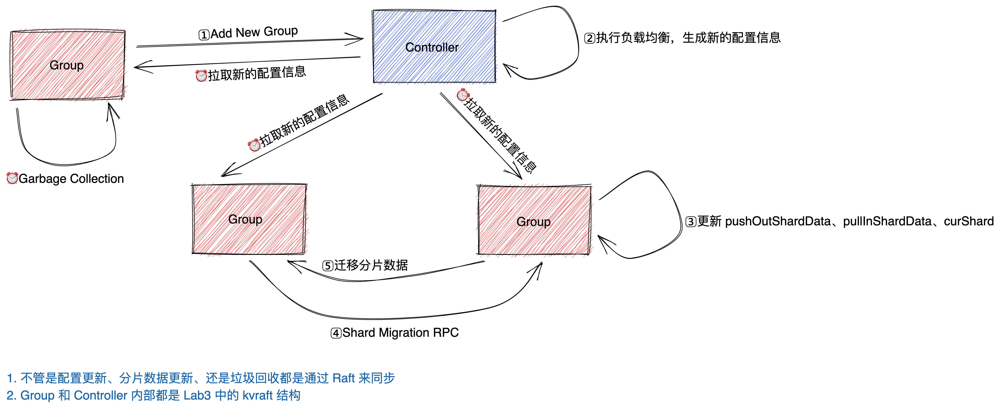
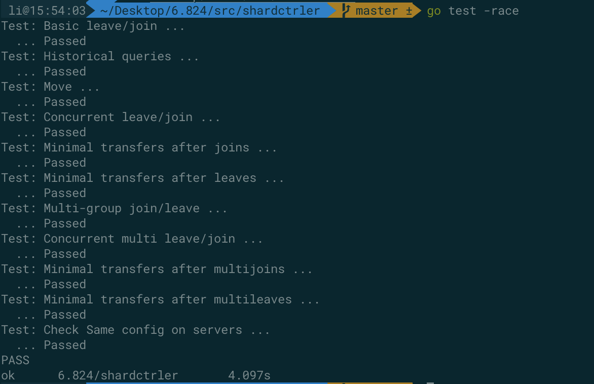
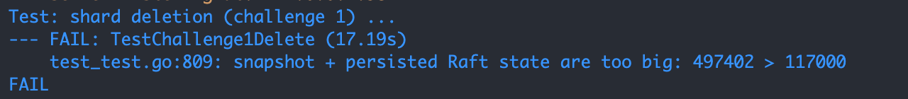
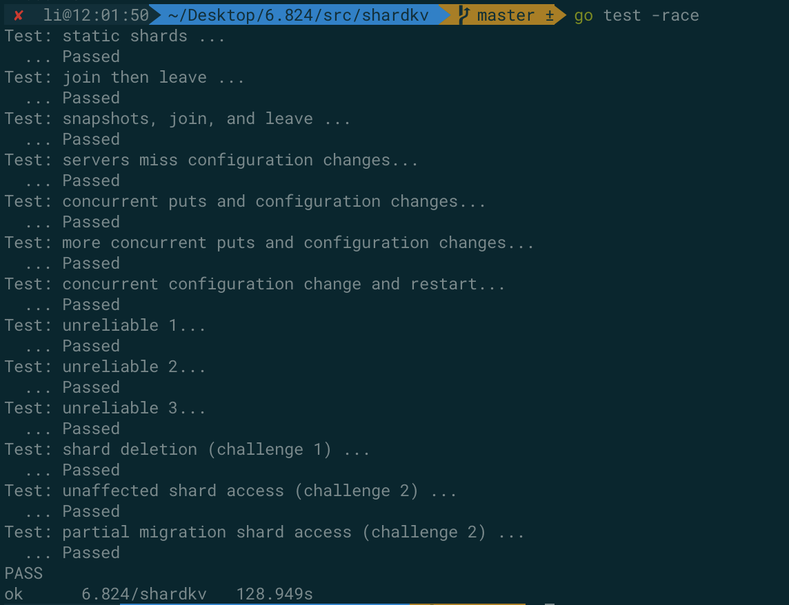

## lab4A

lab2 和 lab3 构成基础分布式数据库的框架，实现多节点间的数据一致性，支持增删查改，数据同步和快照保存。然而，在实际应用中，当数据增长到一定程度时，若仍然使用单一集群服务所有数据，将会造成大量访问挤压到leader上，增加集群压力，延长请求响应时间

这是由于 lab2 和 lab3 所构成的分布式数据库的核心在于分布式缓存数据，确保在leader宕机后，集群仍然可用，并没有考虑集群负载问题。每时每刻，所有数据请求都集中在一台机器上，显而易见的，在数据访问高峰期，请求队列将会无比漫长，客户等待时间也会变长。一个非常直接的解决方法，就是将数据按照某种方式分开存储到不同的集群上，将不同的请求引流到不同的集群，降低单一集群的压力，提供更为高效、更为健壮的服务。lab4 要做的就是这个事情

lab4 就是要实现分库分表，将不同的数据划分到不同的集群上，保证相应数据请求引流到对应的集群。这里，将互不相交并且合力组成完整数据库的每一个数据库子集称为 shard。在同一阶段中，shard 与集群的对应关系称为配置，随着时间的推移，新集群的加入或者现有集群的离去，shard 需要在不同集群之中进行迁移

- 一个 shard 是一组 key/value 键值对，例如所有以 "a" 开始的 key，或者所有以 "b" 开始的 key
- 一个 replica group 负责管理一个或多个 shard 的服务
- shard controller 决定每一个 shard 由哪个 replica group 服务，并且保存 shard 和 group 的映射信息，这些信息就是 **Configuration**；shard controller 还负责 group 之间 shard 的负载均衡。系统中只有一个 Controller

> 不管是 group 还是 controller，它们都是一个 Raft 集群。这里相当于实现了一个 mutil-Raft

### 整理实现

整体实现和 lab3 差不多，相当于一个简化版的 lab3。lab3 的 `Put/Append/Get` 操作相当于现在的 `Join/Leave/Move/Query` 操作，我们只需要实现具体的 `Join/Leave/Move/Query` 的逻辑即可

另外还需要实现 *负载均衡* 操作

### 细节

- golang 的 map 遍历顺序是不确定的，在实现负载均衡的时候，我们需要一个确定的遍历顺序，避免每个 follower 执行负载均衡得到的结果不一致
- map 直接赋值其实复制的是底层的地址，类似于 C 的指针赋值。因此我们在创建一个新的 Configuration 的时候，需要用 `make` 分配一个新的 map

### Join

`Join` 操作将多个集群加入到分布式数据库中，然后执行一次负载均衡

```go
func (sc *ShardCtrler) make_join(servers map[int][]string) {
	new_config := sc.make_newConfig()
	// 1. 添加 servers 到 Groups 中
	for k, v := range servers {
		new_config.Groups[k] = v
	}
	sc.configs = append(sc.configs, new_config)

	// 2. 执行负载均衡
	sc.make_balance()
}
```

### Leave

`Leave` 操作将多个集群移除分布式数据库，然后执行一次负载均衡。移除去的时候，需要将 shard 的映射修改为 0（0 表示无效的映射）

```go
func (sc *ShardCtrler) make_leave(gids []int) {
	new_config := sc.make_newConfig()
	// 1. 清除被 gids[] 管理的 Shards 映射
	for i := range new_config.Shards {
		for _, id := range gids {
			if new_config.Shards[i] == id {
				new_config.Shards[i] = 0
			}
		}
	}
	// 2. 删除 Groups 中和 gids 相等的组
	for key := range new_config.Groups {
		for _, id := range gids {
			if key == id {
				delete(new_config.Groups, key)
			}
		}
	}
	sc.configs = append(sc.configs, new_config)
	// 3. 执行负载均衡
	sc.make_balance()
}
```

### Move

`Move` 操作很简单，将 shard 重新分配给指定的 group 进行管理

```go
func (sc *ShardCtrler) make_move(shard int, gid int) {
	new_config := sc.make_newConfig()
	// 1. 找到 Shards[] 中，下标为 shardId 的分片，将其交给 gid 管理
	for i := range new_config.Shards {
		if i == shard {
			new_config.Shards[i] = gid
		}
	}
	sc.configs = append(sc.configs, new_config)
}
```

### Query

clerk 通过 `Query` 来查询某一个具体的 Configuration，如果传入的索引为 -1 或者大于当前保存的 Configurations 最大索引，那么就返回最新的那个 Configuration

```go
func (sc *ShardCtrler) make_query(num int) Config {
	if num == -1 || num >= len(sc.configs) {
		return sc.configs[len(sc.configs)-1]
	}
	return sc.configs[num]
}
```

### 负载均衡

负载均衡是 lab4A 中最复杂的一个，lab4A 工作量就体现在 *负载均衡*，其它部分的工作量很少，我这里的做法是

1. 首先使用一个 map 统计每个 group 拥有的 shard 数量
2. 然后，将 map 的 key, value 拷贝到自定义的结构体 `KeyValue` 数组中
3. 对 `KeyValues` 进行排序，按照 value 从大到小，相同 value 的按照 gid 从小到大。相同 value 的排序很重要，因为 map 的遍历顺序是不确定的
4. 计算目标分配结果，尽量减少 shard 的移动次数。最后的分配结果一定是形如 *[avg, avg, ... , avg + 1, avg + 1, avg + 1]，其中 avg + 1 有 avg_remain 个*
5. 执行负载均衡，将 shard 多的 groups 的 shard，移动到 shard 少的 gourps 上

```go
func (sc *ShardCtrler) make_balance() {
	config := &sc.configs[len(sc.configs)-1]
	if len(config.Groups) == 0 {
		return
	}
	// 1. 统计各个 Group 拥有的 Shard 数量
	cnt_map := make(map[int]int)
	for gid := range config.Groups {
		cnt_map[gid] = 0
	}
	for _, gid := range config.Shards {
		if gid != 0 {
			cnt_map[gid]++
		}
	}
	// 2. 对统计的结果按照从大到小进行排序
	sort_data := make(KVs, 0)
	for key, value := range cnt_map {
		sort_data = append(sort_data, KeyValue{
			key:   key,
			value: value,
		})
	}
	sort.Sort(KVs(sort_data))
	// 3. 计算目标分配结果. 最后的分布必定是 [avg, avg, ... , avg + 1, avg + 1, avg + 1]，其中 avg + 1 有 avg_remain 个
	avg_num, avg_remain := NShards/len(config.Groups), NShards%len(config.Groups)
	target_map := make(map[int]int)
	for i := range sort_data {
		if avg_remain > 0 {
			sort_data[i].value = avg_num + 1
			avg_remain--
		} else {
			sort_data[i].value = avg_num
		}
		target_map[sort_data[i].key] = sort_data[i].value
	}
	// 4. 进行负载均衡
	cur_index := len(sort_data) - 1
	for i, gid := range config.Shards {
		if gid == 0 {
			config.Shards[i] = sort_data[cur_index].key
			cnt_map[sort_data[cur_index].key]++
		} else if cnt_map[gid] > target_map[gid] {
			cnt_map[gid]--
			config.Shards[i] = sort_data[cur_index].key
			cnt_map[sort_data[cur_index].key]++
		}

		for cur_index >= 0 && cnt_map[sort_data[cur_index].key] == target_map[sort_data[cur_index].key] {
			cur_index--
		}
	}
}
```

### 实验结果



## lab4B

lab4A 实现了 controller，lab4B 要求实现分布式分片数据库，需要完成

1. 配置更新检测
2. 分片数据迁移
   - 一个 group 只能服务自己管的分片数据
   - 做到 group 能在迁移的时候服务其它分片数据，避免整个 group 暂停掉
3. 分片数据的快照
4. 垃圾回收，如果一个 group 不拥有某一分片的服务权，应该删除该分片的内容

整体可以在 lab3 代码的基础上添加

### 数据结构

`shardKV` 数据结构如下

```go
type ShardKV struct {
	mu           sync.Mutex
	me           int
	rf           *raft.Raft
	applyCh      chan raft.ApplyMsg
	make_end     func(string) *labrpc.ClientEnd
	gid          int
	ctrlers      []*labrpc.ClientEnd
	maxraftstate int // snapshot if log grows this big

	// Your definitions here.
	sc                *shardctrler.Clerk                // 用来与 Controller 通信的客户端
	maxSequence       map[int64]int64                   // 记录 client 的最新提交，避免重复执行 Write 操作
	kvDB              map[string]string                 // KV 存储
	commandDetail     map[int64]ReplyMsg                // 记录索引 index 任务的细节，并包含了和 clerk 通信的 channel
	lastConfig        shardctrler.Config                // 上一个配置
	curConfig         shardctrler.Config                // 当前配置
	pushOutShardsData map[int]map[int]map[string]string // 需要传递给其它 Group 的 Shard 数据，{configNum -> (shard -> db)}
	pullInShardData   map[int]int                       // 需要从其它 Group 拉取的数据，{shard -> configNum}
	curShards         []bool                            // 该 group 负责的 Shard
	garbageList       map[int]map[int]bool              // 待回收的 push out 数据
}
```

Shard Migration RPC 数据结构如下

```go
type ShardsMigrationArgs struct {
	ShardId   int // 请求的 Shard 编号
	ConfigNum int // 请求的 Config 编号
	GroupId   int // TODO 测试完删除
}

type ShardsMigrationReply struct {
	ShardDB   map[string]string // 分片数据
	Sequence  map[int64]int64   // maxSequence
	Err       Err               // 错误信息
	ConfigNum int               // Config 配置信息
	ShardId   int               // 回复的是哪一个 Shard Pull 的请求
}
```

垃圾回收数据结构如下

```go
type GCArgs struct {
	ConfigNum int
	ShardId   int
	Err       Err
}

type GCReply struct {
	Err Err
}
```

其余的数据结构基本类似 lab3

### 配置更新检测

当有配置更新的时候，先不更新 Leader 的配置，首先提交到 Raft。然后当 Raft 层再次提交回 kv 层的时候，更新配置，并记录需要拉取的数据，以及需要发送的数据，对于需要发送的数据将 kvDB 中的数据删除并标记 group 已经不拥有该 Shard，以便不响应客户的请求

使用一个 goroutine 定时监测 controller 是否有新的配置产生

- 只有当 `pullInShardData` 为空，即上一个配置下需要获取的数据已经全部到达的时候才可以进行更新
- 只有 Leader 才有资格检测更新，因为更新得到的配置需要提交到 Raft

```go
func (kv *ShardKV) checkConfigurationUpdate() {
	for {
		func() {
			if _, isLeader := kv.rf.GetState(); !isLeader {
				return
			}
			kv.mu.Lock()
			// 本次配置还有新的分片数据没有迁移过来，那么不应该尝试更新下一个配置
			if len(kv.pullInShardData) != 0 {
				kv.mu.Unlock()
				return
			}
			currentNum := kv.curConfig.Num
			nextConfig := kv.sc.Query(currentNum + 1)
			kv.mu.Unlock()
			if nextConfig.Num == currentNum+1 {
				raft.DPrintf("group[%v] - server[%v] found new configuration: %v", kv.gid, kv.me, nextConfig.Num)
				// 配置更新了，提交到 Raft 层
				kv.rf.Start(nextConfig)
			}
		}()
		time.Sleep(time.Millisecond * 50)
	}
}
```

`shardKV` 在收到 Raft 提交的日志的时候，判断该日志操作是不是配置更新操作，如果是的话执行配置更新的相关内容。具体包括

- 更新 `curShard[]`
- 记录需要迁移得到的数据 `pullInShardData` 以及需要迁移出去的数据 `pushOutShardData`
- 更新 `shardKV` 的配置记录

```go
// waitApplyMsg
else if config, ok := applyMsg.Command.(shardctrler.Config); ok { // 配置更新日志
  kv.updateConfiguration(config)
}

func (kv *ShardKV) updateConfiguration(config shardctrler.Config) {
	// 避免过期的请求
	if config.Num <= kv.curConfig.Num {
		return
	}
	// 1. 找出本次配置更新的 pushOutShard 和 pullInShard
	pushOutShard := make([]int, 0)
	pullInShard := make(map[int]int)
	for shardId, gid := range config.Shards {
		if kv.curConfig.Num == 0 && gid == kv.gid {
			// 如果是第一个配置，那么直接赋值就可以了
			kv.curShards[shardId] = true
			continue
		}
		if !kv.curShards[shardId] && gid == kv.gid {
			// 新添加到该 Group 的 Shard
			pullInShard[shardId] = kv.curConfig.Num
		} else if kv.curShards[shardId] && gid != kv.gid {
			// 从该 Group 移除的 Shard
			kv.curShards[shardId] = false
			pushOutShard = append(pushOutShard, shardId)
		}
	}
	kv.pullInShardData = pullInShard
	// 2. 删除 kvDB 中不属于当前 Group 中的数据，并将其放入 pushOutShard 中
	if len(pushOutShard) != 0 {
		kv.pushOutShardsData[kv.curConfig.Num] = make(map[int]map[string]string)
		for _, shardId := range pushOutShard {
			shardDB := make(map[string]string)
			for k, v := range kv.kvDB {
				if key2shard(k) == shardId {
					shardDB[k] = v
					delete(kv.kvDB, k)
				}
			}
			kv.pushOutShardsData[kv.curConfig.Num][shardId] = shardDB
		}
	}
	// 3. 更新 kv 的配置信息
	kv.lastConfig, kv.curConfig = kv.curConfig, config
}
```

### 分片数据迁移

分片数据迁移需要用到配置更新时候记录的 `pullInShardData` 和 `pushOutShardData`

- 对于 pull in 的数据，用一个 goroutine 定时的检测是否还有剩余的分片数据没有获取，获取到数据之后提交到 Raft 层进行同步
- 对于 push out 的数据，由 pull in 的 group 通过 RPC 调用来获取数据。注意不仅仅返回 key-value 的数据，还需要返回 `maxSequence`，因为客户端有可能在这个 group 进行了更多的操作

处理 pull in 数据的时候，同样只有 Leader 有权限进行数据的获取，并且每一轮数据的获取需要同步等待本次所有操作完成。对于失败的 pull 操作，会在下一个周期继续尝试

```go
func (kv *ShardKV) pullShardsData() {
	for {
		func() {
			if _, isLeader := kv.rf.GetState(); !isLeader {
				return
			}
			kv.mu.Lock()
			if len(kv.pullInShardData) == 0 {
				kv.mu.Unlock()
				return
			}
			// 同步变量，等待所有的 pull 结果都出来才能继续下一步
			var wait sync.WaitGroup
			// 对每一个分片，从它原先的 Group 中请求获取数据
			for shardId, configNum := range kv.pullInShardData {
				args := &ShardsMigrationArgs{
					ShardId:   shardId,
					ConfigNum: configNum, // configNum 是上一个配置的 Num
					GroupId:   kv.gid,
				}
				wait.Add(1)
				go func(servers []string) {
					defer wait.Done()
					for _, server := range servers {
						srv := kv.make_end(server)
						reply := &ShardsMigrationReply{}
						if srv.Call("ShardKV.ShardsMigration", args, reply) && reply.Err == OK {
							// 如果获取到了数据，就提交给 Raft，同步到所有的节点
							// 注意这里必须要传递 *reply，否则对于 leader 来说接口类型是 *shardkv.ShardsMigration，而对于 follower 来说是 shardkv.ShardsMigration
							index, _, _ := kv.rf.Start(*reply)
							return
						}
					}
				}(kv.lastConfig.Groups[kv.lastConfig.Shards[shardId]])
			}
			kv.mu.Unlock()
			// 等待该配置所有的 Shard pull 结果都返回了，才能继续下一步，不管返回的是成功还是失败
			// 失败的 pull 会在下一个周期重新尝试
			wait.Wait()
		}()
		time.Sleep(time.Millisecond * 50)
	}
}
```

处理 push out 只需要注意等待对方的配置也更新到最新的时候才可以进行数据迁移

```go
func (kv *ShardKV) ShardsMigration(args *ShardsMigrationArgs, reply *ShardsMigrationReply) {
	if _, isLeader := kv.rf.GetState(); !isLeader {
		reply.Err = ErrWrongLeader
		return
	}
	kv.mu.Lock()
	defer kv.mu.Unlock()
	// 1. 只有当对方也检测到了 Configuration 变化才可以进行数据迁移
	if args.ConfigNum >= kv.curConfig.Num {
		reply.Err = ErrConfig
		return
	}
	reply.ShardId, reply.ConfigNum = args.ShardId, args.ConfigNum
	reply.Sequence, reply.ShardDB = kv.copySequenceAndShardDB(args.ConfigNum, args.ShardId)
	reply.Err = OK
}

func (kv *ShardKV) copySequenceAndShardDB(num int, shardId int) (map[int64]int64, map[string]string) {
	sequence := make(map[int64]int64)
	shardDB := make(map[string]string)
	// 1. 拷贝 maxSequence
	for clientId, seq := range kv.maxSequence {
		sequence[clientId] = seq
	}
	// 2. 拷贝 ShardDB
	for key, value := range kv.pushOutShardsData[num][shardId] {
		shardDB[key] = value
	}
	return sequence, shardDB
}
```

最后在 Raft 提交的时候，更新键值数据库、maxSequence、标记已经拥有该分片数据，并删除已经迁移得到的数据

```go
func (kv *ShardKV) updateShardData(shardData ShardsMigrationReply) {
	raft.DPrintf("group[%v] - server[%v] updateShardData()", kv.gid, kv.me)
	// 0. 如果有已经执行过一次 Shard 迁移数据的更新，那么直接返回
	if _, ok := kv.pullInShardData[shardData.ShardId]; !ok {
		return
	}
	// 1. 删除已经提取到数据的 pullInShardData
	delete(kv.pullInShardData, shardData.ShardId)
	// 2. 更新 DB 和 maxSequence
	for key, value := range shardData.ShardDB {
		kv.kvDB[key] = value
	}
	for clientId, seq := range shardData.Sequence {
		kv.maxSequence[clientId] = Max(kv.maxSequence[clientId], seq)
	}
	// 3. 标记拥有该 Shard
	kv.curShards[shardData.ShardId] = true
	// 4. 更新准备被 GC 回收的数据，会根据这些数据要求对方删除 pushOutShardData 中的数据
	if _, ok := kv.garbageList[shardData.ConfigNum]; !ok {
		kv.garbageList[shardData.ConfigNum] = make(map[int]bool)
	}
	kv.garbageList[shardData.ConfigNum][shardData.ShardId] = true
}
```

### 快照更新

这里只需要添加新的编码、解码数据就可以了

```go
func (kv *ShardKV) encodeKVPersistData() []byte {
	w := new(bytes.Buffer)
	e := labgob.NewEncoder(w)
	// 需要持久化的数据：kvDB、maxSequence
	e.Encode(kv.kvDB)
	e.Encode(kv.maxSequence)
	// pullIn 和 pushOut：当 kvserver 恢复的时候仍然需要回复别的 group 的请求，以及自己也需要拉取新的数据
	e.Encode(kv.pullInShardData)
	e.Encode(kv.pushOutShardsData)
	// curShards：对于 group 拥有哪些 Shards 也需要实时了解
	e.Encode(kv.curShards)
	// curConfig 和 lastConfig：配置信息也是一个需要持久化的数据，不然当别的 group 发送数据来的时候没办法判断自己的配置是不是已经更新到了
	e.Encode(kv.lastConfig)
	e.Encode(kv.curConfig)
	e.Encode(kv.garbageList)
	data := w.Bytes()
	return data
}
func (kv *ShardKV) decodeKVPersistData(snapshot []byte) bool {
	r := bytes.NewBuffer(snapshot)
	d := labgob.NewDecoder(r)
	var maxSequence map[int64]int64
	var kvDB map[string]string
	var pullInShardData map[int]int
	var pushOutShardsData map[int]map[int]map[string]string
	var curShards []bool
	var lastConfig, curConfig shardctrler.Config
	var garbageList map[int]map[int]bool
	if d.Decode(&kvDB) != nil || d.Decode(&maxSequence) != nil || d.Decode(&pullInShardData) != nil || d.Decode(&pushOutShardsData) != nil ||
		d.Decode(&curShards) != nil || d.Decode(&lastConfig) != nil || d.Decode(&curConfig) != nil || d.Decode(&garbageList) != nil {
		return false
	} else {
		kv.kvDB = kvDB
		kv.maxSequence = maxSequence
		kv.pullInShardData, kv.pushOutShardsData = pullInShardData, pushOutShardsData
		kv.curShards = curShards
		kv.lastConfig, kv.curConfig = lastConfig, curConfig
		kv.garbageList = garbageList
		return true
	}
}
```


### 垃圾回收

垃圾回收包括三个数据结构，一个是 `pushOutShardData`，一个是 `pullInShardData`，以及 `curShard`。对于 `pullInShardData` 已经在更新数据的时候删除掉了，`curShard` 的大小是固定的，因此唯一需要回收的就是 `pushOutShardData`

一开始想直接通过 RPC 告知对方可以删除数据了，但是这样由于网络问题可能会丢失请求，测试发现这样确实可以减少压缩的数据大小，但是还是不能通过测试



后面采用和 `pullInShardData` 相同的方式，用一个 `garbageList` 记录待删除的数据，由 goroutine 定时监测是否还有数据要删除，如果有的话给对方发送 RPC，对方在收到 RPC 之后提交到 Raft 告知所有节点删除 `pushOutShardData` 中的数据。等待 RPC 回复之后就删除 `garbageList` 中的数据

这里在提交到 Raft 的时候，复用了 `Op` 这个数据结构，将 `ConfigNum` 当作 Key，`ShardId` 当作 `Seq`，`ClientId` 是一个随机的值。这么做可以同时服用重复检测以及过期请求的代码

```go
func (kv *ShardKV) make_GC() {
	for {
		func() {
			// 1. 只有 Leader 才有资格给对方发送请求，删除 pushOutShardData 中的数据
			if _, isLeader := kv.rf.GetState(); !isLeader {
				return
			}
			kv.mu.Lock()
			defer kv.mu.Unlock()
			// 2. 如果当前 garbageList 中没有待删除的数据，那么直接结束
			if len(kv.garbageList) == 0 {
				return
			}
			// 3. 遍历所有等待删除的数据，发送 RPC 请求给对方 group
			for configNum, shards := range kv.garbageList {
				for shardId := range shards {
					args := &GCArgs{
						ConfigNum: configNum,
						ShardId:   shardId,
					}
					go func(config shardctrler.Config) {
						for _, server := range config.Groups[config.Shards[args.ShardId]] {
							reply := &GCReply{}
							srv := kv.make_end(server)
							// 如果对方已经删除了数据，就删除本地的记录
							if ok := srv.Call("ShardKV.GarbageCollection", args, reply); ok && reply.Err == OK {
								kv.mu.Lock()
								delete(kv.garbageList[configNum], args.ShardId)
								if len(kv.garbageList[configNum]) == 0 {
									delete(kv.garbageList, args.ConfigNum)
								}
								kv.mu.Unlock()
							}
						}
					}(kv.sc.Query(configNum))
				}
			}
		}()
		time.Sleep(time.Millisecond * 100)
	}
}

func (kv *ShardKV) GarbageCollection(args *GCArgs, reply *GCReply) {
	if _, isLeader := kv.rf.GetState(); !isLeader {
		reply.Err = ErrWrongLeader
		return
	}
	kv.mu.Lock()
	// 1. 如果不存在请求删除的数据，说明已经被删除了，那么就返回 OK
	if _, ok := kv.pushOutShardsData[args.ConfigNum]; !ok {
		kv.mu.Unlock()
		reply.Err = OK
		return
	}
	if _, ok := kv.pushOutShardsData[args.ConfigNum][args.ShardId]; !ok {
		kv.mu.Unlock()
		reply.Err = OK
		return
	}
	kv.mu.Unlock()
	// 2. 提交到 Raft 删除
	op := Op{
		Op:       OP_GC,
		Key:      strconv.Itoa(args.ConfigNum),
		ClientId: nrand(),
		Seq:      int64(args.ShardId),
	}
	index, _, _ := kv.rf.Start(op)
	kv.mu.Lock()
	kv.commandDetail[int64(index)] = ReplyMsg{
		ClientId: op.ClientId,
		Seq:      op.Seq,
		Notify:   make(chan CommandReply),
	}
	notifyCh := kv.commandDetail[int64(index)].Notify
	kv.mu.Unlock()
	// 3. 等待被唤醒
	select {
	case result := <-notifyCh:
		reply.Err = result.Err
	case <-time.After(time.Second * 2):
		reply.Err = ErrTimeout
	}
	// 5. 后台回收 channel 的内存空间
	go func() {
		kv.mu.Lock()
		defer kv.mu.Unlock()
		delete(kv.commandDetail, int64(index))
	}()
}
```

### 细节

- pullShard 提交给 Raft 的时候需要传递的是 `*reply` 而不是 `reply`。区别在于，如果传递的是 `reply` 则对于 leader 来说当收到 Raft 日志提交的时候 `applyMsg.Command` 接口的类型是 `*shardkv.ShardMigrationReply`，但是 follower 依旧是 `shardkv.ShardMigrationReply`；传递 `*reply` 的话，不管是 leader 还是 follower 都是 `shardkv.ShardMigrationReply`

### 测试结果


